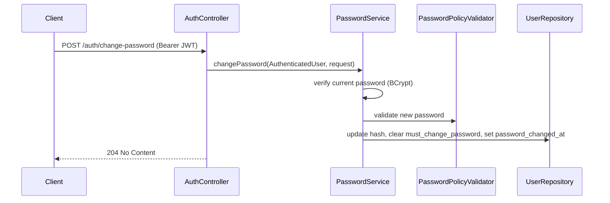
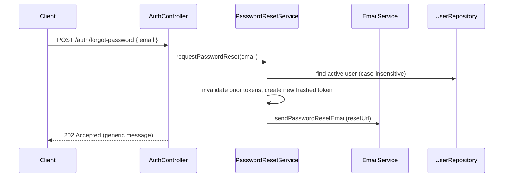
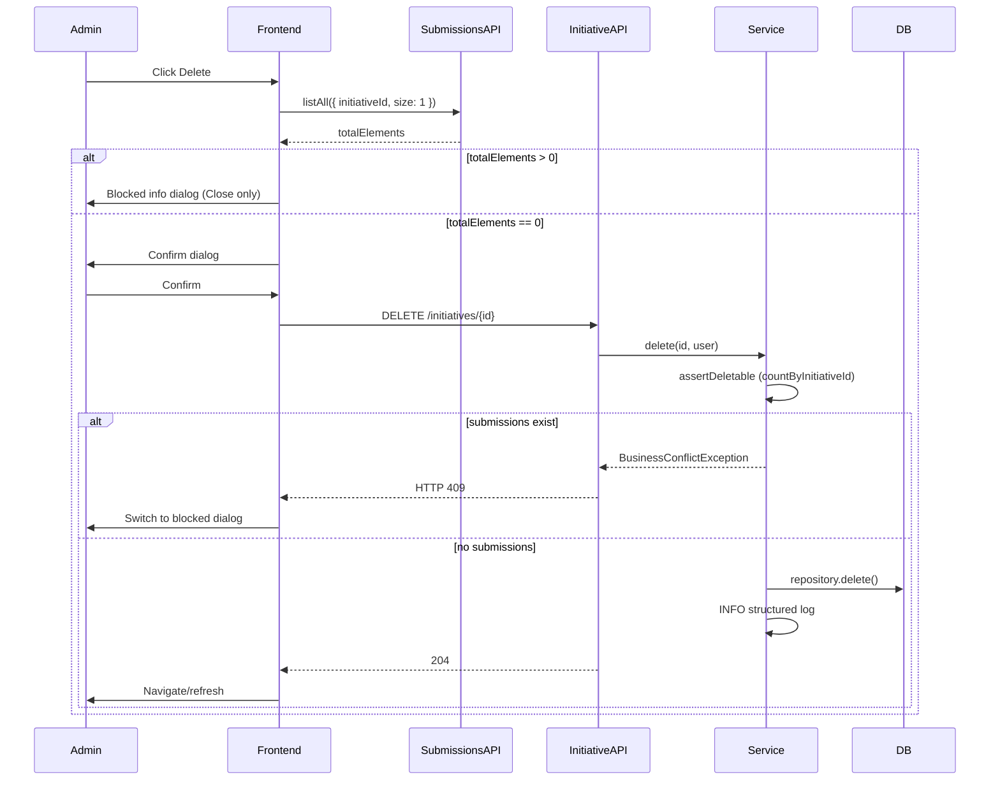
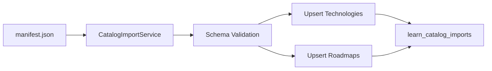

# Learning Hub Architecture

**Current release:** v0.8.0 (Learn module v1 — F16–F18 complete)

## Backend Architecture

The backend is a Java 21 / Spring Boot 3 layered application.

Primary layers:

```text
Controller -> DTO/Mapper -> Service -> Repository -> Domain Entity -> Database
```

### Controller Layer

- Exposes REST APIs under `/api/v1`.
- Applies request validation with Jakarta Validation.
- Uses `@Tag`, `@Operation`, and `@SecurityRequirement` for Swagger/OpenAPI.
- Uses `PageResponse<T>` for paginated API responses.
- Uses `@AuthenticationPrincipal AuthenticatedUser` when current user context is needed.

### DTO and Mapper Layer

- Controllers should not expose entities directly.
- Request DTOs define validation.
- Response DTOs define stable public API contracts.
- Mappers convert entities to DTOs.

### Service Layer

- Required for all business logic.
- Uses constructor injection.
- Applies `@Transactional`.
- Applies method security with `@PreAuthorize`.
- Owns authorization rules beyond global authentication.
- Builds dynamic Specifications for filtering.

### Repository Layer

- Uses Spring Data JPA.
- Uses `JpaRepository`.
- Uses `JpaSpecificationExecutor` for dynamic search/filtering.
- Uses custom query repositories only for SQL-heavy/reporting use cases such as leaderboards.
- Uses `@EntityGraph` when avoiding lazy-loading problems in response mapping.

## Frontend Architecture

The frontend is React + TypeScript + Material UI.

Primary structure:

```text
api -> auth -> routes -> layout -> pages -> components -> types
```

### API Layer

- Axios instance lives in `src/api/httpClient.ts`.
- Feature APIs live in `src/api/*Api.ts`.
- JWT bearer token is attached by Axios interceptor.

### Auth Layer

- Context API owns current user state.
- `AuthProvider` restores session using `/auth/me`.
- `ProtectedRoute` blocks unauthenticated access.
- `MustChangePasswordRoute` redirects users with `mustChangePassword: true` to `/change-password`; allows voluntary access when flag is false.
- `RoleRoute` blocks role-specific routes.
- Password pages: `ChangePasswordPage`, `ForgotPasswordPage`, `ResetPasswordPage`.

### Layout Layer

- `AppLayout` provides responsive shell.
- `Sidebar` renders role-aware navigation.
- `Header` shows user and logout.

### Page Layer

- Pages should orchestrate API calls and compose reusable components.
- Pages must implement loading, error, and empty states.
- Material UI should be used consistently.
- `ProfilePage` at `/profile` — self-service profile view, edit, and avatar management.
- `InitiativeListPage` at `/initiatives` — searchable initiative list with admin management actions.
- `InitiativeDetailPage` at `/initiatives/:initiativeId` — initiative detail with role-aware content.

### Shared Component Patterns (v0.7.1)

Initiative Management uses consistent patterns across create, edit, lifecycle, and delete:

| Pattern | Component | Usage |
|---------|-----------|-------|
| Form dialogs | `CreateInitiativeDialog`, `EditInitiativeDialog` | `maxWidth="md"`, inline `Alert`, discard-unsaved nested dialog |
| Confirm dialogs | `InitiativeLifecycleConfirmDialog` | `maxWidth="sm"`; `variant: confirm \| info` |
| Mutation actions | `InitiativeLifecycleActions`, `InitiativeDeleteAction` | Compact icons (list) or outlined buttons (detail) |
| Success feedback | `InitiativeManagementSnackbar` | Bottom-center, 5s auto-hide, success only |
| Status display | `InitiativeStatusChip` | List, detail, dialog summaries |
| Long text (list) | `TruncatedTextWithTooltip` | Title/reward truncation with tooltip |
| Long text (detail/dialog) | `WrappingText`, `longTextWrapSx` | Full text with pre-wrap |
| Form state | `initiativeFormState` | Shared validation, dirty baseline, API payload builders |
| Copy | `initiativeMessages` | Centralized user-facing strings |

**Role gating:** Admin management controls (`isAdmin`) are passed as optional callbacks from pages to list views. Employees never receive edit, lifecycle, or delete callbacks.


## Database Architecture

Database is PostgreSQL managed by Flyway.

Core schemas/tables:

- `users` (`must_change_password`, `password_changed_at` — added in v0.2; avatar metadata — added in v0.5)
- `roles`
- `user_roles`
- `password_reset_tokens` (v0.2)
- `learning_initiatives` (constraints tightened in V10, V11)
- `certificate_documents`
- `certificate_submissions` (`initiative_id` FK `ON DELETE RESTRICT`)
- `notifications` (v0.6)
- `study_material_folders`
- `study_materials`
- `study_material_download_events`
- `projects`
- `project_members`
- `project_knowledge_folders`
- `project_knowledge_items`
- `project_knowledge_access_events`

## Entity Relationships

```text
User -> UserRole -> Role
User -> PasswordResetToken
User -> LearningInitiative.createdBy
User -> CertificateSubmission.employee
User -> CertificateSubmission.reviewedBy
User -> CertificateDocument.uploadedBy
User -> StudyMaterial.uploadedBy
User -> Project.createdBy
User -> ProjectMember.user
User -> ProjectKnowledgeItem.uploadedBy
```

```text
LearningInitiative -> CertificateSubmission -> CertificateDocument
```

```text
StudyMaterialFolder -> child folders
StudyMaterialFolder -> StudyMaterial -> StudyMaterialDownloadEvent
```

```text
Project -> ProjectMember
Project -> ProjectKnowledgeFolder -> child folders
Project -> ProjectKnowledgeItem -> ProjectKnowledgeAccessEvent
```

## Authentication Flow

1. User calls `POST /api/v1/auth/login`.
2. Backend authenticates credentials using Spring Security and BCrypt.
3. Backend returns JWT and user summary (includes `mustChangePassword`).
4. Frontend stores JWT in session storage.
5. If `mustChangePassword` is `true`, frontend redirects to `/change-password`.
6. Axios attaches `Authorization: Bearer <token>`.
7. Frontend restores session with `GET /api/v1/auth/me`.
8. Expired, invalid, pre-password-change, or deactivated-user JWT returns 401 and frontend clears auth state.

## Password Management Architecture

Password management extends the existing `auth` module. It reuses the `User` entity, `UserRepository`, `PasswordEncoder` (BCrypt strength 12), and JWT authentication infrastructure. Business logic is centralized in `PasswordService`, `PasswordResetService`, `PasswordPolicyValidator`, and `EmailService`.

### Change Password Flow

Authenticated users change their own password via `POST /api/v1/auth/change-password`.



**Rules:**

- Requires a valid JWT (`@AuthenticationPrincipal AuthenticatedUser`).
- Validates `currentPassword`, `newPassword`, and `confirmNewPassword`.
- Rejects when the new password equals the current password.
- Clears `must_change_password` and sets `password_changed_at` on success.
- Invalidates active password reset tokens for the user.

**Frontend:** `ChangePasswordPage` at `/change-password`. After success, the client re-authenticates and redirects to the dashboard.

### First Login Password Change Enforcement

Users with `must_change_password = true` may log in and receive a JWT, but application APIs are restricted until they change their password.

**Flag is set when:**

- An admin resets a user's password (`POST /api/v1/users/{id}/reset-password`).
- Users are bulk-imported with the default temporary password (`Temp@12345`).

**API contract:**

- `LoginResponse.user.mustChangePassword` and `GET /api/v1/auth/me` expose the flag to the client.
- Login is not blocked; enforcement happens at the API and route level.

**Frontend:** `MustChangePasswordRoute` redirects authenticated users with `mustChangePassword: true` to `/change-password` and prevents access to other application routes until the flag is cleared.

### Password Reset Token Flow

Reset tokens are stored in `password_reset_tokens` (Flyway `V7__password_management.sql`), separate from the `users` table.

| Column | Purpose |
|--------|---------|
| `id` | UUID primary key |
| `user_id` | FK to `users` (CASCADE on delete) |
| `token_hash` | SHA-256 hash of the raw token (never store the raw value) |
| `expires_at` | Configurable TTL (`app.password-reset.expiration`, default `PT1H`) |
| `used_at` | Set when consumed; `NULL` while active |
| `created_at` | Audit timestamp |

**Lifecycle:**

1. On forgot-password: invalidate all unused tokens for the user, insert a new hashed token.
2. On reset-password: validate token is active and unexpired, update password, mark token used.
3. On voluntary password change: invalidate outstanding reset tokens.

Indexes exist on `user_id`, `token_hash`, and active token lookups.

**`POST /api/v1/auth/reset-password`:**

- Accepts the raw token from the email link plus the new password.
- Marks the token as used and clears `must_change_password`.

**Frontend:** `ResetPasswordPage` at `/reset-password?token=...`.

### Forgot Password Email Flow

Self-service recovery begins with a public, unauthenticated request.



**`POST /api/v1/auth/forgot-password`:**

- Always returns the same `202` response whether or not the email exists (account enumeration prevention).
- Only processes active users.
- Generates a cryptographically secure URL-safe token; only the SHA-256 hash is persisted.

`EmailService` sends password reset messages using classpath templates — not hardcoded body content in Java.

| Template | Path |
|----------|------|
| HTML | `templates/email/forgot-password.html` |
| Plain text | `templates/email/forgot-password.txt` |

Placeholders: `{{fullName}}`, `{{resetUrl}}`, `{{expirationMinutes}}`.

**Modes** (`app.mail.mode`):

| Mode | Behavior |
|------|----------|
| `log` (default) | Logs the reset URL to application logs; no SMTP required (local development). |
| `smtp` | Sends via `JavaMailSender`; compatible with Microsoft 365 and Gmail SMTP. |

Configuration: `app.mail.from`, `spring.mail.*`, `app.password-reset.frontend-reset-url`.

**Frontend:** `ForgotPasswordPage` at `/forgot-password`, linked from the login page.

### MustChangePasswordFilter

A `OncePerRequestFilter` registered after `JwtAuthenticationFilter` in the security chain.

When the authenticated principal has `mustChangePassword = true`, all requests are blocked with `403 Forbidden` except:

| Method | Path |
|--------|------|
| `GET` | `/api/v1/auth/me` |
| `POST` | `/api/v1/auth/change-password` |
| `GET` | `/api/v1/health` |
| `GET` | `/actuator/health/**` |

Response body uses the standard `ErrorResponse` format with message: `Password change required before accessing this resource`.

### JWT Invalidation Strategy

JWTs are stateless — there is no server-side token blacklist. Invalidation is enforced at request time in `JwtAuthenticationFilter` via `JwtService.isTokenValid()`:

1. **Password change:** `password_changed_at` is set on the `users` row. Tokens with `iat` at or before `password_changed_at` are rejected.
2. **Deactivated user:** Tokens are rejected when `AuthenticatedUser.isEnabled()` is `false` (user `active = false`).
3. **Expiry:** Standard JWT `exp` claim validation continues to apply.

After a password change, the client should obtain a new JWT (re-login or session refresh via login call).

### Security Design Decisions

| Concern | Mitigation |
|---------|------------|
| Password hashing | BCrypt strength 12 via shared `PasswordEncoder` bean |
| Password policy | `PasswordPolicyValidator`: length 8–128, uppercase, lowercase, digit, special character; must not match email |
| Reset token storage | SHA-256 hash only; 32-byte cryptographically secure raw token |
| Single-use tokens | `used_at` timestamp; prior tokens invalidated on new forgot-password request |
| Token expiration | Configurable `app.password-reset.expiration` (default 1 hour) |
| Account enumeration | Forgot-password returns identical response for known and unknown emails |
| Invalid reset token | Generic `400` message for expired, used, or invalid tokens |
| Login errors | Generic `Invalid email or password` via `BadCredentialsException` |
| First-login enforcement | `MustChangePasswordFilter` blocks application APIs until password is changed |
| Admin reset | Sets `must_change_password = true` to force change on next login |
| Email content | External templates; no secrets embedded in Java source |
| Stateless JWT model | Invalidation via `password_changed_at` and `active` checks rather than a token blacklist |

## Profile Management Architecture

Profile management is a self-service module under `com.company.learninghub.profile`. It reuses the existing `User` entity and `UserRepository` — no duplicate identity tables. Avatar files are stored via `AvatarStorageService` (local filesystem).

### Profile APIs

| Method | Path | Description |
|--------|------|-------------|
| `GET` | `/api/v1/profile` | Current user profile |
| `PUT` | `/api/v1/profile` | Update full name and email |
| `POST` | `/api/v1/profile/avatar` | Upload or replace avatar |
| `DELETE` | `/api/v1/profile/avatar` | Delete avatar (idempotent) |
| `GET` | `/api/v1/profile/avatar` | Serve avatar image bytes |

**Access:** `@PreAuthorize("isAuthenticated()")` — all operations scoped to the JWT principal's user ID.

### Email Change Flow

When a user updates their email via `PUT /api/v1/profile`:

1. Service validates email uniqueness (case-insensitive).
2. User row is updated.
3. If email changed, `AuthenticationService.issueAccessToken()` returns a new JWT in `ProfileUpdateResponse.accessToken`.
4. Frontend updates session storage and refreshes auth state.

### Avatar Storage

- Metadata on `users` row (Flyway `V8__profile_avatar.sql`).
- Files stored at `avatars/{userId}/{uuid}.{ext}` via `AvatarStorageService`.
- Allowed types: JPEG, PNG, WebP; max size configurable (`app.profile.avatar-max-size-bytes`, default 2 MB).
- `UserSummaryResponse.avatarUrl` on login and `/auth/me` points to `GET /api/v1/profile/avatar`.

**Frontend:** `ProfilePage`, `ProfileAvatar`, `ProfileAvatarUpload`, `ProfileEditForm`.

## Initiative Management Architecture (v0.7.1)

Initiative Management extends the existing `initiative` backend module and v0.7.0 frontend experience. Business logic is centralized in `LearningInitiativeService`; authorization uses `@PreAuthorize` on service methods.

### Initiative APIs

| Method | Path | Auth | Description |
|--------|------|------|-------------|
| `GET` | `/api/v1/initiatives` | Admin, Employee | Paginated list; employees see visible ACTIVE only |
| `GET` | `/api/v1/initiatives/{id}` | Admin, Employee | Detail; employees get 404 for non-visible |
| `POST` | `/api/v1/initiatives` | Admin | Create (always DRAFT) |
| `PUT` | `/api/v1/initiatives/{id}` | Admin | Update metadata (status preserved) |
| `DELETE` | `/api/v1/initiatives/{id}` | Admin | Hard delete when no submissions |
| `POST` | `/api/v1/initiatives/{id}/publish` | Admin | DRAFT → ACTIVE |
| `POST` | `/api/v1/initiatives/{id}/return-to-draft` | Admin | ACTIVE → DRAFT |
| `POST` | `/api/v1/initiatives/{id}/mark-expired` | Admin | ACTIVE → EXPIRED |
| `POST` | `/api/v1/initiatives/{id}/reactivate` | Admin | EXPIRED → ACTIVE |

### Employee Visibility

`LearningInitiative.isVisibleToEmployeesAt(instant)` enforces:

- Status must be **ACTIVE**
- Start date ≤ today (UTC calendar day)
- Expiry date ≥ today (UTC calendar day)

Non-visible initiatives return **404** to employees (not 403).

### Frontend Module Structure

```text
frontend/src/
├── api/initiativesApi.ts
├── types/initiatives.ts
├── pages/initiatives/
│   ├── InitiativeListPage.tsx
│   ├── InitiativeDetailPage.tsx
│   └── initiativeListParams.ts
└── components/initiatives/
    ├── CreateInitiativeDialog.tsx
    ├── EditInitiativeDialog.tsx
    ├── InitiativeLifecycleActions.tsx
    ├── InitiativeDeleteAction.tsx
    ├── InitiativeLifecycleConfirmDialog.tsx
    ├── InitiativeListViews.tsx
    ├── initiativeFormState.ts
    └── initiativeMessages.ts
```

## Lifecycle Management Architecture (F14)

Lifecycle transitions are **never** performed via metadata PUT. Dedicated service methods enforce a transition matrix:

```text
DRAFT   → ACTIVE   (publish)
ACTIVE  → DRAFT    (returnToDraft)
ACTIVE  → EXPIRED  (markExpired)
EXPIRED → ACTIVE   (reactivate)
```

`assertTransition(from, to)` throws `IllegalArgumentException` (400) for blocked paths.

| Action | Pre-validation |
|--------|--------------|
| Publish | Full metadata validation; start ≥ today |
| Return to Draft | None (metadata unchanged) |
| Mark Expired | Expiry set to today (UTC); start clamped if future |
| Reactivate | Expiry ≥ today (UTC) and ≥ start date |

**Frontend:** `InitiativeLifecycleActions` renders only valid actions per status. `InitiativeLifecycleConfirmDialog` shows status-specific messaging before API call.

## Delete Workflow Architecture (F15)

Delete eligibility depends **only** on certificate submission count.



**Backend layers:**

1. `assertDeletable()` — `CertificateSubmissionRepository.countByInitiativeId() > 0` → `BusinessConflictException`
2. `initiativeRepository.delete()` — hard delete
3. DB FK `certificate_submissions.initiative_id ON DELETE RESTRICT` — defence in depth
4. `GlobalExceptionHandler` — `BusinessConflictException` and `DataIntegrityViolationException` → HTTP 409

**Frontend:** `InitiativeDeleteAction` handles eligibility pre-check, confirm/blocked dialogs, and 409 race handling via `isConflictError()`.

## Notifications Architecture (v0.6)

In-app notifications persist in the `notifications` table (Flyway `V9__create_notifications.sql`).

| Method | Path | Description |
|--------|------|-------------|
| `GET` | `/api/v1/notifications` | Paginated inbox |
| `GET` | `/api/v1/notifications/unread-count` | Badge count |
| `PATCH` | `/api/v1/notifications/{id}/read` | Mark single read |
| `POST` | `/api/v1/notifications/mark-all-read` | Mark all read |

Certificate workflow producers (`CERTIFICATE_SUBMITTED`, `CERTIFICATE_APPROVED`, etc.) are wired in `CertificateSubmissionService`. Frontend: bell, dropdown, `/notifications` page.

## Authorization Model

### Global Roles

- `ADMIN`
- `EMPLOYEE`

### Project Roles

- `OWNER`
- `CONTRIBUTOR`
- `VIEWER`

### Common Rules

- Admin-only APIs use `@PreAuthorize("hasRole('ADMIN')")`.
- Mixed APIs use service-level role/project membership checks.
- Employees can access only their own certificate submissions.
- Members-only projects require project membership unless system admin.

## API Design Standards

- Base path: `/api/v1`
- Use nouns for resources.
- Use standard HTTP status codes.
- Use `PageResponse<T>` for paged endpoints.
- Use request/response DTOs.
- Use validation annotations on request DTOs.
- Use Swagger annotations on controllers.
- Keep error responses centralized through global exception handling.

## Module Structure

```text
com.company.learninghub.<module>/
├── controller/
├── domain/
├── dto/
├── mapper/
├── repository/
└── service/
```

## DTO Pattern

- Create request DTOs for writes.
- Update request DTOs for mutations.
- Response DTOs for API responses.
- Avoid returning JPA entities.
- DTOs should reflect API contract, not database internals.

## Service Layer Pattern

- Constructor injection only.
- Transaction boundaries live here.
- Authorization and business rules live here.
- Normalize search/filter inputs here.
- Use meaningful exceptions with consistent messages.

## Repository Pattern

- Prefer Spring Data repositories.
- Use Specifications for dynamic filters.
- Avoid nullable JPQL predicates of the form `(:param IS NULL OR field LIKE :param)` when parameter type inference may break in PostgreSQL.
- Use native SQL only when needed for reporting/window functions.

## Flyway Migration Strategy

- Use sequential versioned migrations:

```text
V1__create_identity_schema.sql
V2__seed_default_users.sql
V3__create_learning_initiatives.sql
V4__create_certificate_submissions.sql
V5__create_study_material_repository.sql
V6__create_project_knowledge_repository.sql
V7__password_management.sql
V8__profile_avatar.sql
V9__create_notifications.sql
V10__relax_learning_initiative_date_constraint.sql
V11__tighten_learning_initiative_text_limits.sql
V12__learn_technologies.sql
V13__learn_catalog_foundation.sql
V14__learn_roadmap_catalog.sql
V15__learn_progress.sql
```

- Add migrations only for schema changes.
- Never modify already-applied migrations after merge.
- Use constraints and indexes for integrity/performance.
- Use `TIMESTAMPTZ` for UTC timestamps.

## Testing Strategy

Required test types:

- Service tests for business rules.
- Controller tests for API contracts.
- Method-security tests for role restrictions.
- Integration tests when database behavior is risk-prone.
- Import/parser tests for file import flows.

## Swagger / OpenAPI Strategy

- Every controller needs `@Tag`.
- Every endpoint needs `@Operation`.
- Authenticated APIs should use `@SecurityRequirement(name = "bearerAuth")`.
- Swagger sections should match business module names:
  - Authentication (`/auth/login`, `/auth/me`, `/auth/change-password`, `/auth/forgot-password`, `/auth/reset-password`)
  - Learning Initiatives (CRUD, lifecycle, delete)
  - Certificate Submissions
  - Leaderboards
  - Study Materials
  - Project Knowledge
  - Users
  - Profile
  - Notifications
  - **Learn** (technologies, roadmaps, progress, catalog manage)

---

## Learn Module Architecture (v0.8.0 — F16–F18)

> **Engineering Learning Hub owns guidance, not knowledge.**

The Learn module is a **Learning Navigation Platform**: catalog-first technology discovery, read-only roadmaps, and employee-owned progress overlay.

Full documentation: `docs/learn/README.md`

### Technology Catalog

- **Source:** `backend/src/main/resources/catalog/technologies/wave-1.json` (30 technologies)
- **Import:** `CatalogImportService` on startup — upsert by `slug`
- **Storage:** `learn_technologies` with catalog metadata columns (V13)
- **Admin model:** Curation only — publish, hide, archive, feature override, org notes, project links
- **Employee view:** Published + `catalog_present` technologies with search and filters

### Roadmap Framework

- **Source:** `backend/src/main/resources/catalog/roadmaps/*.json` (5 seed roadmaps)
- **Storage:** `learn_roadmaps` → `learn_roadmap_stages` → `learn_roadmap_stage_resources`
- **Read-only at runtime** — no admin API to edit roadmap content
- **Service:** `LearnRoadmapService` loads ordered stages with learning/practice resources
- **Relationship:** One roadmap per technology via `technology_slug` FK

### Progress Tracking

- **Tables:** `learn_learning_enrollments`, `learn_stage_progress` (V15)
- **Service:** `LearningProgressService`
- **Overlay model:** Progress references catalog `stage_id` UUIDs — no roadmap duplication
- **Status lifecycle:** NOT_STARTED → IN_PROGRESS → COMPLETED; LEFT on abandon
- **BR-PR10:** No admin API to edit employee progress

### Catalog Import Pipeline



- **Trigger:** `ApplicationRunner` on startup
- **Idempotent:** Skip if `(catalogVersion, packageType)` already imported
- **Config:** `app.catalog.import.enabled`, `app.catalog.import.fail-fast`
- **Validator:** `CatalogSchemaValidator` (JSON Schema)

### Search Architecture

- **Backend:** `LearnTechnologyService` — whole-term case-insensitive search across name, slug, tags, description
- **Ranking:** In-memory relevance scoring after DB filter
- **Filters:** category, difficulty, status (admin)
- **Frontend:** `TechnologySearchBar`, `TechnologyFilterBar`, URL query sync via `learnListParams.ts`

### Enrollment

- **API:** `POST /api/v1/learn/enrollments`
- **Rules:** One active enrollment per user per technology; auto-start at stage 1
- **Storage:** `learn_learning_enrollments` with partial unique index
- **Owner-scoped:** `@AuthenticationPrincipal` on all progress operations

### Stage Progress

- **API:** `POST /api/v1/learn/enrollments/{id}/complete-stage`
- **Sequential validation:** Only next incomplete stage may be completed
- **Storage:** `learn_stage_progress` — one row per completed stage per enrollment
- **Computed:** `progressPercent`, `currentStageId`, `estimatedRemainingEffort` in service layer

### Roadmap Relationships

```text
learn_technologies (slug)
    └── learn_roadmaps (technology_slug FK)
            └── learn_roadmap_stages (roadmap_id FK)
                    └── learn_roadmap_stage_resources (stage_id FK)

users
    └── learn_learning_enrollments (user_id, technology_slug)
            └── learn_stage_progress (enrollment_id, stage_id FK → learn_roadmap_stages)

learn_technologies ←→ projects (learn_technology_project_links)
```

### Database Overview (Learn tables)

| Table | Migration | Purpose |
|-------|-----------|---------|
| `learn_technologies` | V12, V13 | Technology catalog |
| `learn_technology_project_links` | V12 | Tech ↔ project cross-nav |
| `learn_catalog_imports` | V13 | Import audit |
| `learn_roadmaps` | V14 | Roadmap header |
| `learn_roadmap_stages` | V14 | Ordered stages |
| `learn_roadmap_stage_resources` | V14 | External resources |
| `learn_learning_enrollments` | V15 | User enrollments |
| `learn_stage_progress` | V15 | Completed stages |

ER diagram: `docs/learn/database-overview.md`

### API Flow (Learn)

```text
Employee browse:
  GET /learn/technologies → GET /learn/technologies/{id}
  → POST /learn/enrollments → GET /learn/progress/technologies/{id}
  → POST /learn/enrollments/{id}/complete-stage

Journey resume:
  GET /learn/journey → continueLearning → roadmap page

Admin curation:
  GET /learn/manage/technologies → PATCH .../curation
  → POST .../publish|hide|archive

Catalog status:
  GET /learn/manage/catalog/status
```

Full API reference: `docs/learn/api-reference.md`

### Frontend Flow (Learn)

```text
/learn (LearnHomePage)
  ├── Featured technologies
  ├── Continue Learning (from journey API)
  └── Search → /learn/technologies

/learn/technologies (TechnologyListPage)
  └── /learn/technologies/:id (TechnologyDetailPage)
        ├── Start Learning / Continue Learning
        ├── Related projects
        └── /learn/technologies/:id/roadmap (RoadmapPage)
              ├── RoadmapHero (progress-first)
              ├── RoadmapJourneyTimeline
              └── RoadmapStageCard[] (Complete Stage)

/learn/manage (LearnManagePage) [ADMIN]
  └── Technology curation + catalog status
```

**Key files:**
- `frontend/src/api/learnApi.ts`
- `frontend/src/pages/learn/*`
- `frontend/src/components/learn/*`
- `frontend/src/types/learn.ts`, `roadmap.ts`, `progress.ts`

### Learn Controllers

| Controller | Base path |
|------------|-----------|
| `LearnTechnologyController` | `/learn/technologies` |
| `LearnRoadmapController` | `/learn/technologies/{slug\|id}/roadmap` |
| `LearningProgressController` | `/learn/enrollments`, `/learn/journey`, `/learn/progress` |
| `LearnTechnologyManageController` | `/learn/manage/technologies` |
| `LearnCatalogManageController` | `/learn/manage/catalog` |
