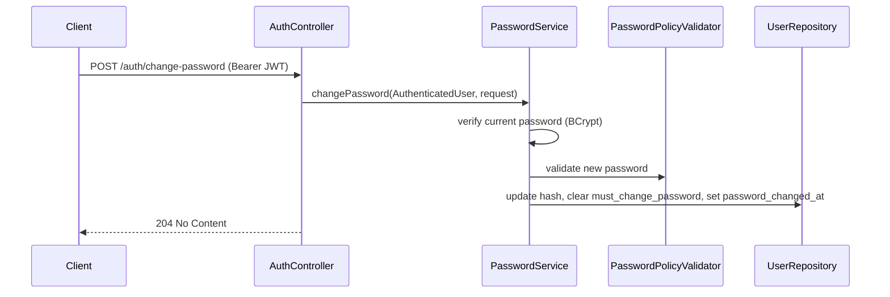
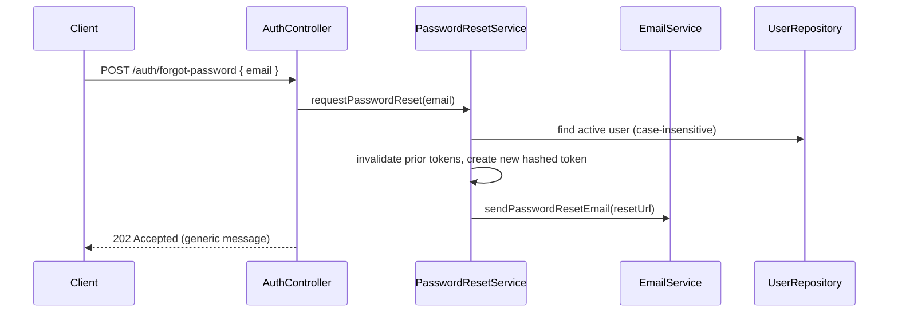

# Learning Hub Architecture

**Current release:** v0.2 (Password Management)

## Backend Architecture

The backend is a Java 21 / Spring Boot 3 layered application.

Primary layers:

```text
Controller -> DTO/Mapper -> Service -> Repository -> Domain Entity -> Database
```

### Controller Layer

- Exposes REST APIs under `/api/v1`.
- Applies request validation with Jakarta Validation.
- Uses `@Tag`, `@Operation`, and `@SecurityRequirement` for Swagger/OpenAPI.
- Uses `PageResponse<T>` for paginated API responses.
- Uses `@AuthenticationPrincipal AuthenticatedUser` when current user context is needed.

### DTO and Mapper Layer

- Controllers should not expose entities directly.
- Request DTOs define validation.
- Response DTOs define stable public API contracts.
- Mappers convert entities to DTOs.

### Service Layer

- Required for all business logic.
- Uses constructor injection.
- Applies `@Transactional`.
- Applies method security with `@PreAuthorize`.
- Owns authorization rules beyond global authentication.
- Builds dynamic Specifications for filtering.

### Repository Layer

- Uses Spring Data JPA.
- Uses `JpaRepository`.
- Uses `JpaSpecificationExecutor` for dynamic search/filtering.
- Uses custom query repositories only for SQL-heavy/reporting use cases such as leaderboards.
- Uses `@EntityGraph` when avoiding lazy-loading problems in response mapping.

## Frontend Architecture

The frontend is React + TypeScript + Material UI.

Primary structure:

```text
api -> auth -> routes -> layout -> pages -> components -> types
```

### API Layer

- Axios instance lives in `src/api/httpClient.ts`.
- Feature APIs live in `src/api/*Api.ts`.
- JWT bearer token is attached by Axios interceptor.

### Auth Layer

- Context API owns current user state.
- `AuthProvider` restores session using `/auth/me`.
- `ProtectedRoute` blocks unauthenticated access.
- `MustChangePasswordRoute` redirects users with `mustChangePassword: true` to `/change-password`.
- `RoleRoute` blocks role-specific routes.
- Password pages: `ChangePasswordPage`, `ForgotPasswordPage`, `ResetPasswordPage`.

### Layout Layer

- `AppLayout` provides responsive shell.
- `Sidebar` renders role-aware navigation.
- `Header` shows user and logout.

### Page Layer

- Pages should orchestrate API calls and compose reusable components.
- Pages must implement loading, error, and empty states.
- Material UI should be used consistently.

## Database Architecture

Database is PostgreSQL managed by Flyway.

Core schemas/tables:

- `users` (`must_change_password`, `password_changed_at` — added in v0.2)
- `roles`
- `user_roles`
- `password_reset_tokens` (v0.2)
- `learning_initiatives`
- `certificate_documents`
- `certificate_submissions`
- `study_material_folders`
- `study_materials`
- `study_material_download_events`
- `projects`
- `project_members`
- `project_knowledge_folders`
- `project_knowledge_items`
- `project_knowledge_access_events`

## Entity Relationships

```text
User -> UserRole -> Role
User -> PasswordResetToken
User -> LearningInitiative.createdBy
User -> CertificateSubmission.employee
User -> CertificateSubmission.reviewedBy
User -> CertificateDocument.uploadedBy
User -> StudyMaterial.uploadedBy
User -> Project.createdBy
User -> ProjectMember.user
User -> ProjectKnowledgeItem.uploadedBy
```

```text
LearningInitiative -> CertificateSubmission -> CertificateDocument
```

```text
StudyMaterialFolder -> child folders
StudyMaterialFolder -> StudyMaterial -> StudyMaterialDownloadEvent
```

```text
Project -> ProjectMember
Project -> ProjectKnowledgeFolder -> child folders
Project -> ProjectKnowledgeItem -> ProjectKnowledgeAccessEvent
```

## Authentication Flow

1. User calls `POST /api/v1/auth/login`.
2. Backend authenticates credentials using Spring Security and BCrypt.
3. Backend returns JWT and user summary (includes `mustChangePassword`).
4. Frontend stores JWT in session storage.
5. If `mustChangePassword` is `true`, frontend redirects to `/change-password`.
6. Axios attaches `Authorization: Bearer <token>`.
7. Frontend restores session with `GET /api/v1/auth/me`.
8. Expired, invalid, pre-password-change, or deactivated-user JWT returns 401 and frontend clears auth state.

## Password Management Architecture

Password management extends the existing `auth` module. It reuses the `User` entity, `UserRepository`, `PasswordEncoder` (BCrypt strength 12), and JWT authentication infrastructure. Business logic is centralized in `PasswordService`, `PasswordResetService`, `PasswordPolicyValidator`, and `EmailService`.

### Change Password Flow

Authenticated users change their own password via `POST /api/v1/auth/change-password`.



**Rules:**

- Requires a valid JWT (`@AuthenticationPrincipal AuthenticatedUser`).
- Validates `currentPassword`, `newPassword`, and `confirmNewPassword`.
- Rejects when the new password equals the current password.
- Clears `must_change_password` and sets `password_changed_at` on success.
- Invalidates active password reset tokens for the user.

**Frontend:** `ChangePasswordPage` at `/change-password`. After success, the client re-authenticates and redirects to the dashboard.

### First Login Password Change Enforcement

Users with `must_change_password = true` may log in and receive a JWT, but application APIs are restricted until they change their password.

**Flag is set when:**

- An admin resets a user's password (`POST /api/v1/users/{id}/reset-password`).
- Users are bulk-imported with the default temporary password (`Temp@12345`).

**API contract:**

- `LoginResponse.user.mustChangePassword` and `GET /api/v1/auth/me` expose the flag to the client.
- Login is not blocked; enforcement happens at the API and route level.

**Frontend:** `MustChangePasswordRoute` redirects authenticated users with `mustChangePassword: true` to `/change-password` and prevents access to other application routes until the flag is cleared.

### Password Reset Token Flow

Reset tokens are stored in `password_reset_tokens` (Flyway `V7__password_management.sql`), separate from the `users` table.

| Column | Purpose |
|--------|---------|
| `id` | UUID primary key |
| `user_id` | FK to `users` (CASCADE on delete) |
| `token_hash` | SHA-256 hash of the raw token (never store the raw value) |
| `expires_at` | Configurable TTL (`app.password-reset.expiration`, default `PT1H`) |
| `used_at` | Set when consumed; `NULL` while active |
| `created_at` | Audit timestamp |

**Lifecycle:**

1. On forgot-password: invalidate all unused tokens for the user, insert a new hashed token.
2. On reset-password: validate token is active and unexpired, update password, mark token used.
3. On voluntary password change: invalidate outstanding reset tokens.

Indexes exist on `user_id`, `token_hash`, and active token lookups.

**`POST /api/v1/auth/reset-password`:**

- Accepts the raw token from the email link plus the new password.
- Marks the token as used and clears `must_change_password`.

**Frontend:** `ResetPasswordPage` at `/reset-password?token=...`.

### Forgot Password Email Flow

Self-service recovery begins with a public, unauthenticated request.



**`POST /api/v1/auth/forgot-password`:**

- Always returns the same `202` response whether or not the email exists (account enumeration prevention).
- Only processes active users.
- Generates a cryptographically secure URL-safe token; only the SHA-256 hash is persisted.

`EmailService` sends password reset messages using classpath templates — not hardcoded body content in Java.

| Template | Path |
|----------|------|
| HTML | `templates/email/forgot-password.html` |
| Plain text | `templates/email/forgot-password.txt` |

Placeholders: `{{fullName}}`, `{{resetUrl}}`, `{{expirationMinutes}}`.

**Modes** (`app.mail.mode`):

| Mode | Behavior |
|------|----------|
| `log` (default) | Logs the reset URL to application logs; no SMTP required (local development). |
| `smtp` | Sends via `JavaMailSender`; compatible with Microsoft 365 and Gmail SMTP. |

Configuration: `app.mail.from`, `spring.mail.*`, `app.password-reset.frontend-reset-url`.

**Frontend:** `ForgotPasswordPage` at `/forgot-password`, linked from the login page.

### MustChangePasswordFilter

A `OncePerRequestFilter` registered after `JwtAuthenticationFilter` in the security chain.

When the authenticated principal has `mustChangePassword = true`, all requests are blocked with `403 Forbidden` except:

| Method | Path |
|--------|------|
| `GET` | `/api/v1/auth/me` |
| `POST` | `/api/v1/auth/change-password` |
| `GET` | `/api/v1/health` |
| `GET` | `/actuator/health/**` |

Response body uses the standard `ErrorResponse` format with message: `Password change required before accessing this resource`.

### JWT Invalidation Strategy

JWTs are stateless — there is no server-side token blacklist. Invalidation is enforced at request time in `JwtAuthenticationFilter` via `JwtService.isTokenValid()`:

1. **Password change:** `password_changed_at` is set on the `users` row. Tokens with `iat` at or before `password_changed_at` are rejected.
2. **Deactivated user:** Tokens are rejected when `AuthenticatedUser.isEnabled()` is `false` (user `active = false`).
3. **Expiry:** Standard JWT `exp` claim validation continues to apply.

After a password change, the client should obtain a new JWT (re-login or session refresh via login call).

### Security Design Decisions

| Concern | Mitigation |
|---------|------------|
| Password hashing | BCrypt strength 12 via shared `PasswordEncoder` bean |
| Password policy | `PasswordPolicyValidator`: length 8–128, uppercase, lowercase, digit, special character; must not match email |
| Reset token storage | SHA-256 hash only; 32-byte cryptographically secure raw token |
| Single-use tokens | `used_at` timestamp; prior tokens invalidated on new forgot-password request |
| Token expiration | Configurable `app.password-reset.expiration` (default 1 hour) |
| Account enumeration | Forgot-password returns identical response for known and unknown emails |
| Invalid reset token | Generic `400` message for expired, used, or invalid tokens |
| Login errors | Generic `Invalid email or password` via `BadCredentialsException` |
| First-login enforcement | `MustChangePasswordFilter` blocks application APIs until password is changed |
| Admin reset | Sets `must_change_password = true` to force change on next login |
| Email content | External templates; no secrets embedded in Java source |
| Stateless JWT model | Invalidation via `password_changed_at` and `active` checks rather than a token blacklist |

## Authorization Model

### Global Roles

- `ADMIN`
- `EMPLOYEE`

### Project Roles

- `OWNER`
- `CONTRIBUTOR`
- `VIEWER`

### Common Rules

- Admin-only APIs use `@PreAuthorize("hasRole('ADMIN')")`.
- Mixed APIs use service-level role/project membership checks.
- Employees can access only their own certificate submissions.
- Members-only projects require project membership unless system admin.

## API Design Standards

- Base path: `/api/v1`
- Use nouns for resources.
- Use standard HTTP status codes.
- Use `PageResponse<T>` for paged endpoints.
- Use request/response DTOs.
- Use validation annotations on request DTOs.
- Use Swagger annotations on controllers.
- Keep error responses centralized through global exception handling.

## Module Structure

```text
com.company.learninghub.<module>/
├── controller/
├── domain/
├── dto/
├── mapper/
├── repository/
└── service/
```

## DTO Pattern

- Create request DTOs for writes.
- Update request DTOs for mutations.
- Response DTOs for API responses.
- Avoid returning JPA entities.
- DTOs should reflect API contract, not database internals.

## Service Layer Pattern

- Constructor injection only.
- Transaction boundaries live here.
- Authorization and business rules live here.
- Normalize search/filter inputs here.
- Use meaningful exceptions with consistent messages.

## Repository Pattern

- Prefer Spring Data repositories.
- Use Specifications for dynamic filters.
- Avoid nullable JPQL predicates of the form `(:param IS NULL OR field LIKE :param)` when parameter type inference may break in PostgreSQL.
- Use native SQL only when needed for reporting/window functions.

## Flyway Migration Strategy

- Use sequential versioned migrations:

```text
V1__create_identity_schema.sql
V2__seed_default_users.sql
...
V7__password_management.sql
```

- Add migrations only for schema changes.
- Never modify already-applied migrations after merge.
- Use constraints and indexes for integrity/performance.
- Use `TIMESTAMPTZ` for UTC timestamps.

## Testing Strategy

Required test types:

- Service tests for business rules.
- Controller tests for API contracts.
- Method-security tests for role restrictions.
- Integration tests when database behavior is risk-prone.
- Import/parser tests for file import flows.

## Swagger / OpenAPI Strategy

- Every controller needs `@Tag`.
- Every endpoint needs `@Operation`.
- Authenticated APIs should use `@SecurityRequirement(name = "bearerAuth")`.
- Swagger sections should match business module names:
  - Authentication (`/auth/login`, `/auth/me`, `/auth/change-password`, `/auth/forgot-password`, `/auth/reset-password`)
  - Learning Initiatives
  - Certificate Submissions
  - Leaderboards
  - Study Materials
  - Project Knowledge
  - Users
