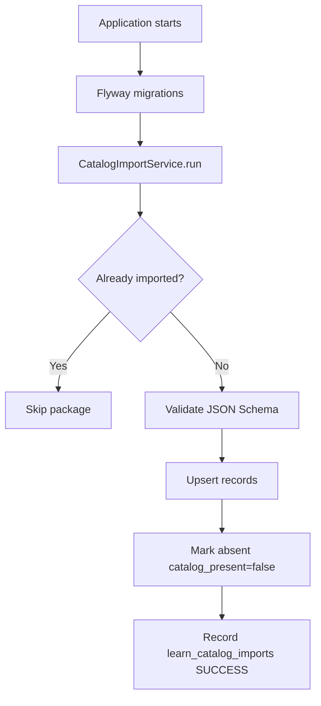

# Learn Module — Catalog Documentation

The platform catalog is the **source of truth** for technology metadata and roadmap content. It ships as versioned JSON in the repository and is imported into PostgreSQL on application startup.

**Current catalog version:** `1.1.1`  
**Location:** `backend/src/main/resources/catalog/`

---

## Directory structure

```text
catalog/
├── manifest.json                 # Root manifest — version and package list
├── technologies/
│   └── wave-1.json               # 30 technology records (v1.0.0)
├── roadmaps/
│   ├── aws.json
│   ├── docker.json
│   ├── java.json
│   ├── react.json
│   └── spring-boot.json          # 5 roadmaps (v1.0.1)
└── schemas/
    ├── technology.schema.json    # JSON Schema for technology records
    └── roadmap.schema.json       # JSON Schema for roadmap records
```

---

## manifest.json

The manifest declares the catalog version and which packages to import.

```json
{
  "catalogVersion": "1.1.1",
  "releasedAt": "2026-07-03T07:40:00Z",
  "description": "Engineering Learning Hub platform catalog",
  "packages": [
    {
      "type": "technologies",
      "path": "technologies/wave-1.json",
      "version": "1.0.0",
      "recordCount": 30
    },
    {
      "type": "roadmaps",
      "path": "roadmaps/",
      "version": "1.0.1",
      "pattern": "*.json"
    }
  ]
}
```

| Field | Purpose |
|-------|---------|
| `catalogVersion` | Top-level version tracked in `learn_catalog_imports` |
| `packages[]` | Ordered list of import packages |
| `type` | `technologies` or `roadmaps` |
| `path` | Classpath-relative file or directory |
| `pattern` | Glob for directory packages (roadmaps) |

---

## Technology package

**File:** `technologies/wave-1.json`  
**Records:** 30 technologies

Each record includes:

| Field | Example | Notes |
|-------|---------|-------|
| `slug` | `spring-boot` | Stable identifier; never change after ship |
| `name` | `Spring Boot` | Display name |
| `shortName` | `Spring Boot` | |
| `description` | … | |
| `category` | `BACKEND` | Must match schema enum |
| `difficulty` | `INTERMEDIATE` | |
| `featured` | `true` | Catalog default |
| `estimatedDuration` | `6-8 weeks` | |
| `officialWebsite` | URL | |
| `officialDocumentation` | URL | |
| `tags` | `["java", "backend"]` | Search tags |

**Slugs (30):** `spring-boot`, `java`, `nodejs`, `graphql`, `react`, `angular`, `typescript`, `vite`, `aws`, `azure`, `google-cloud`, `kubernetes`, `docker`, `terraform`, `postgresql`, `mongodb`, `redis`, `python-ml`, `langchain`, `openai-api`, `junit`, `playwright`, `owasp-top-10`, `oauth2`, `kotlin-android`, `flutter`, `microservices`, `event-driven-architecture`, `apache-spark`, `apache-kafka`

---

## Roadmap package

**Directory:** `roadmaps/*.json`  
**Records:** 5 roadmaps (technologies with learning paths in Wave 1)

Each roadmap file structure:

```json
{
  "technologySlug": "spring-boot",
  "version": "1.0.1",
  "description": "Structured Spring Boot learning path",
  "source": "platform-team",
  "sourceUrl": "https://roadmap.sh/spring-boot",
  "stages": [
    {
      "order": 1,
      "slug": "introduction",
      "title": "Introduction",
      "description": "...",
      "estimatedEffort": "1 week",
      "learningResources": [
        {
          "slug": "spring-docs",
          "title": "Spring Boot Reference",
          "url": "https://docs.spring.io/...",
          "type": "OFFICIAL_DOCUMENTATION",
          "provider": "Spring",
          "freePaid": "FREE"
        }
      ],
      "practiceResources": []
    }
  ]
}
```

Roadmaps with seed data: **aws**, **docker**, **java**, **react**, **spring-boot**.

---

## Schema validation

Before import, each package is validated against JSON Schema:

| Schema | Path | Validates |
|--------|------|-----------|
| Technology | `schemas/technology.schema.json` | `wave-1.json` records |
| Roadmap | `schemas/roadmap.schema.json` | Each `roadmaps/*.json` file |

Validator: `CatalogSchemaValidator` (networknt JSON Schema)

Import fails fast when `app.catalog.import.fail-fast=true` (default).

---

## Versioning

| Level | Field | Example |
|-------|-------|---------|
| Catalog | `manifest.catalogVersion` | `1.1.1` |
| Technology package | `packages[].version` | `1.0.0` |
| Roadmap package | `packages[].version` | `1.0.1` |
| Individual roadmap | `roadmap.version` | `1.0.1` |

Version bumps trigger reimport when the `(catalogVersion, packageType)` pair has not been recorded in `learn_catalog_imports`.

---

## Startup import

**Service:** `CatalogImportService` (`ApplicationRunner`)

**Configuration:**

| Property | Default | Description |
|----------|---------|-------------|
| `app.catalog.import.enabled` | `true` | Run import on startup |
| `app.catalog.import.fail-fast` | `true` | Abort startup on import failure |

**Import lifecycle:**



**Technologies import:**
- Upsert by `slug`
- Preserve org overrides (`featured_override`, `org_notes`, `status` if admin-set)
- Set `catalog_present = false` for slugs removed from package

**Roadmaps import:**
- Upsert roadmap + stages + resources by slug
- Replace stage/resource trees on version change
- Mark missing roadmaps `catalog_present = false`

---

## Reimport

Reimport occurs automatically when:

1. `catalogVersion` in manifest changes, or
2. A package has no successful import record for the current version

**Important:** Full roadmap replace creates new stage UUIDs. Existing employee progress may reference stale stage IDs after a major catalog replace — document and plan migrations for production catalog updates.

---

## Organization overrides

Admins curate catalog content without editing JSON:

| Override | API | Stored in |
|----------|-----|-----------|
| Featured | `PATCH .../curation` | `featured_override` |
| Visibility | `publish` / `hide` / `archive` | `status` |
| Org notes | `PATCH .../curation` | `org_notes` |
| Project links | `POST/DELETE .../project-links` | `learn_technology_project_links` |

Catalog reimport **preserves** admin overrides where designed (org notes, featured override, non-catalog status changes).

---

## Adding content

See [`docs/contributing.md`](../contributing.md) for step-by-step instructions to add technologies and roadmaps.

**Rules:**
- Never edit roadmap content via admin UI
- Always validate against JSON Schema before commit
- Bump `catalogVersion` in manifest when shipping changes
- Run full startup verification after catalog changes

---

## Related documentation

- Frozen spec: `docs/v0.8.0/10-catalog-specification.md`
- Import implementation: `backend/src/main/java/com/company/learninghub/learn/catalog/CatalogImportService.java`
- F16-R report: `docs/releases/release-v0.8.0-f16-r-implementation-report.md`
