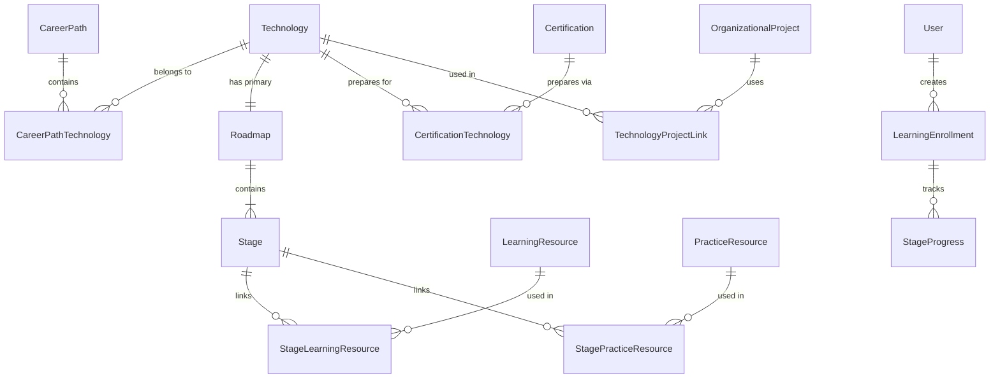

# v0.8.0 — Information Architecture

**Module:** Learn (+ platform module boundaries)  
**Status:** Design refinement v1.1 — draft for approval

---

## 1. Platform module architecture

```text
Engineering Learning Hub
├── Dashboard          — role-aware entry point
├── Learn              — learning guidance (NEW v0.8.0)
├── Projects           — organizational engineering knowledge (independent)
├── Initiatives        — internal learning campaigns
├── Leaderboards       — recognition
├── Users              — administration (admin)
├── My Certifications  — certificate submissions (employee)
└── Profile            — self-service identity
```

| Module | Owns | Does not own |
|--------|------|--------------|
| **Learn** | Technologies, Career Paths, Roadmaps, Learning Resources, Practice Resources, Certifications, Progress | Projects, Initiatives, hosted content |
| **Projects** | Organizational project records, KT documents, architecture assets | Roadmaps, Learning Resources, Certifications |

**Cross-navigation:** Technology (Learn) ↔ Organizational Project (Projects) — optional, bidirectional, neither module owns the other.

---

## 2. Application navigation (v0.8.0)

### 2.1 Employee navigation

```text
┌─────────────────────────────────────┐
│  Engineering Learning Hub           │
├─────────────────────────────────────┤
│  🏠 Dashboard                       │
│  📚 Learn                    ← NEW  │
│  🗂️ Projects                 ← independent module
│  🎯 Initiatives                     │
│  🏆 Leaderboards                    │
│  📜 My Certifications        ← rename│
│  👤 Profile                         │
├─────────────────────────────────────┤
│  🔔 Notifications (header bell)     │
└─────────────────────────────────────┘
```

| Item | Path | Change from v0.7.1 |
|------|------|-------------------|
| Dashboard | `/` | Add Learn widgets |
| Learn | `/learn` | **New** |
| Projects | `/projects` | **Retained** — independent module |
| Initiatives | `/initiatives` | Unchanged |
| Leaderboards | `/leaderboards/global` | Unchanged |
| My Certifications | `/submissions` | Renamed |
| Profile | `/profile` | Unchanged |

**Removed from sidebar (retained elsewhere)**

| Item | New access path |
|------|-----------------|
| Notifications | Header bell + `/notifications` |
| Submit Certificate | Learn Certification CTA, Initiative detail, My Certifications |
| Study Materials | Settings link |

### 2.2 Admin navigation

```text
┌─────────────────────────────────────┐
│  Engineering Learning Hub (Admin)   │
├─────────────────────────────────────┤
│  🏠 Dashboard                       │
│  📚 Learn                    ← NEW  │
│  🗂️ Projects                 ← independent module
│  🎯 Initiatives                     │
│  👥 Users                           │
│  📋 Review Submissions       ← rename│
│  🏆 Leaderboards                    │
│  ⚙️ Settings                 ← NEW  │
└─────────────────────────────────────┘
```

---

## 3. Learn module IA

### 3.1 Site map

```text
Learn
├── Home (/learn)
├── Career Paths
│   ├── List (/learn/career-paths)
│   └── Detail (/learn/career-paths/:id)
├── Technologies
│   ├── List (/learn/technologies)
│   ├── Detail (/learn/technologies/:id)
│   └── Roadmap (/learn/technologies/:id/roadmap)
├── Certifications
│   ├── List (/learn/certifications)
│   └── Detail (/learn/certifications/:id)
├── My Journey (/learn/journey) [Employee]
└── Manage (/learn/manage) [Admin]
    ├── Career Paths
    ├── Technologies
    ├── Roadmaps (per Technology)
    ├── Learning Resources (library + Stage assignment)
    ├── Practice Resources (library + Stage assignment)
    └── Certifications
```

> **Note:** There is no `/learn/projects` or `/learn/manage/projects`. Organizational Projects live entirely under `/projects`.

### 3.2 Navigation pattern within Learn

| Tab | Route | Visible to |
|-----|-------|------------|
| Home | `/learn` | All |
| Career Paths | `/learn/career-paths` | All |
| Technologies | `/learn/technologies` | All |
| Certifications | `/learn/certifications` | All |
| My Journey | `/learn/journey` | Employee |
| Manage | `/learn/manage` | Admin |

### 3.3 Breadcrumb patterns

| Page | Breadcrumb |
|------|------------|
| Technology Roadmap | Learn › Technologies › AWS › Roadmap |
| Technology detail | Learn › Technologies › Spring Boot |
| Career Path detail | Learn › Career Paths › Cloud Engineer |
| Certification detail | Learn › Certifications › AWS Cloud Practitioner |
| Admin Roadmap editor | Learn › Manage › Technologies › AWS › Edit Roadmap |
| Organizational Project | Projects › Insurance Portal |

---

## 4. Projects module IA (independent)

### 4.1 Site map (reference — not redesigned in v0.8.0 Learn scope)

```text
Projects
├── List (/projects)
└── Detail (/projects/:projectId)
    ├── Overview
    ├── Client & Business Domain
    ├── Requirements (BRD, FRD)
    ├── Technical Design & Architecture
    ├── API Documentation
    ├── Git Repository & Environment URLs
    ├── Deployment Guide
    ├── KT Documents & Release Notes
    ├── Team & Contacts
    └── Related Technologies → links to Learn
```

### 4.2 Example organizational Projects

| Project | Domain |
|---------|--------|
| Banking Platform | Financial services |
| Insurance Portal | Insurance |
| Employee Portal | HR / internal tools |
| Claims Management System | Insurance operations |

---

## 5. Cross-navigation surfaces

### 5.1 Learn → Projects

**Location:** Technology detail page (`/learn/technologies/:id`)

**Section:** Related Organization Projects

```text
Spring Boot
  ...
  Related Organization Projects
    • Insurance Portal        → /projects/{id}
    • Employee Portal         → /projects/{id}
    • Payment Gateway         → /projects/{id}
```

- Read-only list of linked organizational Projects
- Empty state: "No linked organization projects yet"
- Admin manages links from Learn Manage (Technology editor) or Projects module

### 5.2 Projects → Learn

**Location:** Project detail page (`/projects/:projectId`)

**Section:** Related Technologies

```text
Insurance Portal
  ...
  Related Technologies
    • Spring Boot             → /learn/technologies/{id}
    • React                   → /learn/technologies/{id}
    • Docker                  → /learn/technologies/{id}
    • PostgreSQL              → /learn/technologies/{id}
```

- Read-only list of linked Learn Technologies
- Click navigates to Learn Technology detail / Roadmap

### 5.3 Cross-reference data model (conceptual)

```text
technology_project_links
  technology_id   FK → learn.technologies
  project_id      FK → projects.projects
  created_at
  UNIQUE(technology_id, project_id)
```

Single junction table; displayed bidirectionally. Maintained by admin from either module.

---

## 6. Page inventory

### 6.1 Employee-facing Learn pages

| Page | Route | Purpose | Key components |
|------|-------|---------|----------------|
| Learn Home | `/learn` | Discovery and resume | Continue Learning, Featured Paths |
| Career Path List | `/learn/career-paths` | Browse paths | Search, filter, cards |
| Career Path Detail | `/learn/career-paths/:id` | Path overview | Technology list, Start CTA |
| Technology List | `/learn/technologies` | Browse technologies | Category filter, search |
| Technology Detail | `/learn/technologies/:id` | Tech overview | Description, Roadmap link, **Related Organization Projects** |
| Roadmap View | `/learn/technologies/:id/roadmap` | Core learning UI | Stage stepper, Learning Resources, Practice Resources |
| Certification List | `/learn/certifications` | Browse certs | Provider filter |
| Certification Detail | `/learn/certifications/:id` | Cert overview | Readiness, linked Roadmap |
| My Journey | `/learn/journey` | Personal dashboard | Enrollments, progress |

### 6.2 Admin-facing Learn pages

| Page | Route | Purpose |
|------|-------|---------|
| Manage Home | `/learn/manage` | Admin overview |
| Career Path List (admin) | `/learn/manage/career-paths` | CRUD |
| Technology Editor | `/learn/manage/technologies/:id` | Edit technology + **link Projects** |
| Roadmap Editor | `/learn/manage/technologies/:id/roadmap` | Stage CRUD, resource assignment |
| Resource Library | `/learn/manage/resources` | Learning + Practice Resources |
| Certification List (admin) | `/learn/manage/certifications` | Certification CRUD |

---

## 7. Entity relationship diagram



---

## 8. Content hierarchy (Learn module)

```text
Level 0: Learn Module
Level 1: Career Path | Technology | Certification
Level 2: Roadmap (under Technology)
Level 3: Stage (under Roadmap)
Level 4: Learning Resource | Practice Resource (under Stage)
```

**Depth rule:** Employees reach a Resource within 4 levels from Learn home.

---

## 9. Naming and labeling guidelines

### 9.1 UI labels (mandatory terminology)

| Context | Label | Avoid |
|---------|-------|-------|
| Module name | Learn | Training, Courses, LMS |
| Sequence unit | Stage | Lesson, Module, Chapter |
| Study links | Learning Resources | Materials, Content |
| Hands-on links | Practice Resources | Learning Projects, Practice Projects |
| Industry cred | Certification | Course completion |
| Org systems module | Projects | Learning projects, portfolio |
| Org system record | [Project Name] | Practice Resource, Learning Project |

### 9.2 Disambiguation

| Term | Meaning | Module |
|------|---------|--------|
| **Practice Resource** | External hands-on exercise link on a Roadmap Stage | Learn |
| **Learning Resource** | External study link on a Roadmap Stage | Learn |
| **Project** / **Organizational Project** | Real company system (Insurance Portal, etc.) | Projects |
| **Related Organization Projects** | Cross-nav section on Technology detail | Learn (display only) |
| **Related Technologies** | Cross-nav section on Project detail | Projects (display only) |

---

## 10. Dashboard integration

### Employee widgets (new)

| Widget | Content | Link |
|--------|---------|------|
| Continue Learning | Current enrollment, next Stage | Roadmap |
| Featured Career Path | Admin-featured path | Career Path detail |
| Certification Readiness | Nearest READY certification | Certification detail |

### Admin widgets (new)

| Widget | Content | Link |
|--------|---------|------|
| Learn Content Health | Draft / published counts | `/learn/manage` |

---

## 11. Settings page (admin shell)

| Section | v0.8.0 scope |
|---------|--------------|
| Learn | Link to `/learn/manage` |
| Study Materials | Link to `/study-materials` (demoted) |
| General | Placeholder |

Projects is **not** under Settings — it has primary sidebar navigation.

---

**Next document:** [03-business-rules.md](./03-business-rules.md)
