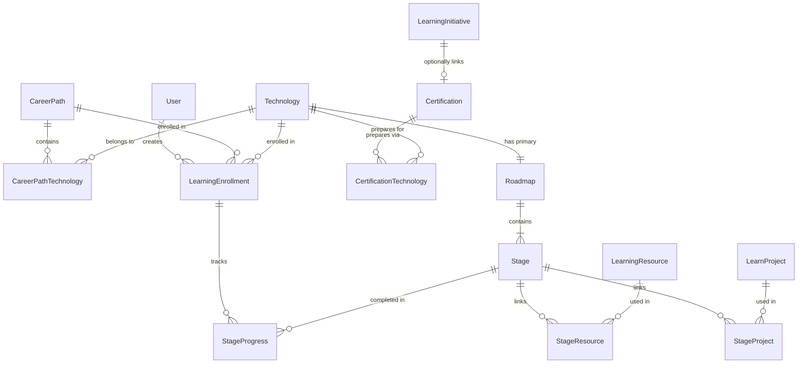

# v0.8.0 — Information Architecture

**Module:** Learn  
**Status:** Draft for approval

---

## 1. Application navigation (v0.8.0)

### 1.1 Employee navigation

```text
┌─────────────────────────────────────┐
│  Engineering Learning Hub           │
├─────────────────────────────────────┤
│  🏠 Dashboard                       │
│  📚 Learn                    ← NEW  │
│  🎯 Initiatives                     │
│  🏆 Leaderboards                    │
│  📜 My Certifications        ← rename│
│  👤 Profile                         │
├─────────────────────────────────────┤
│  🔔 Notifications (header bell)     │
└─────────────────────────────────────┘
```

| Item | Path | Icon (proposed) | Change from v0.7.1 |
|------|------|-----------------|-------------------|
| Dashboard | `/` | DashboardOutlined | Add Learn widgets |
| Learn | `/learn` | MenuBookOutlined or RouteOutlined | **New** |
| Initiatives | `/initiatives` | SchoolOutlined | Unchanged |
| Leaderboards | `/leaderboards/global` | EmojiEventsOutlined | Unchanged |
| My Certifications | `/submissions` | WorkspacePremiumOutlined | Renamed |
| Profile | `/profile` | PersonOutlined | Unchanged |

**Removed from sidebar (retained elsewhere)**

| Item | New access path |
|------|-----------------|
| Notifications | Header bell + `/notifications` |
| Submit Certificate | Learn Certification CTA, Initiative detail, My Certifications page |
| Study Materials | Settings link or Learn admin cross-reference (future) |
| Projects | Settings link (Project Knowledge Repository) |

### 1.2 Admin navigation

```text
┌─────────────────────────────────────┐
│  Engineering Learning Hub (Admin)   │
├─────────────────────────────────────┤
│  🏠 Dashboard                       │
│  📚 Learn                    ← NEW  │
│  🎯 Initiatives                     │
│  👥 Users                           │
│  📋 Review Submissions       ← rename│
│  🏆 Leaderboards                    │
│  ⚙️ Settings                 ← NEW  │
└─────────────────────────────────────┘
```

| Item | Path | Change from v0.7.1 |
|------|------|-------------------|
| Review Submissions | `/submissions/review` | Renamed from "Certificate Review" |
| Settings | `/settings` | New shell; Learn config subset in v1 |

---

## 2. Learn module IA

### 2.1 Site map

```text
Learn
├── Home (/learn)
├── Career Paths
│   ├── List (/learn/career-paths)
│   └── Detail (/learn/career-paths/:id)
├── Technologies
│   ├── List (/learn/technologies)
│   ├── Detail (/learn/technologies/:id)
│   └── Roadmap (/learn/technologies/:id/roadmap)
├── Certifications
│   ├── List (/learn/certifications)
│   └── Detail (/learn/certifications/:id)
├── Learn Projects
│   └── Detail (/learn/projects/:id)
├── My Journey (/learn/journey) [Employee]
└── Manage (/learn/manage) [Admin]
    ├── Career Paths
    ├── Technologies
    ├── Roadmaps (per Technology)
    ├── Learning Resources (library + Stage assignment)
    ├── Learn Projects
    └── Certifications
```

### 2.2 Navigation pattern within Learn

Use **horizontal tabs** below the Learn page header (consistent with admin status filter tabs on Initiatives list):

| Tab | Route | Visible to |
|-----|-------|------------|
| Home | `/learn` | All |
| Career Paths | `/learn/career-paths` | All |
| Technologies | `/learn/technologies` | All |
| Certifications | `/learn/certifications` | All |
| My Journey | `/learn/journey` | Employee |
| Manage | `/learn/manage` | Admin |

Active tab persists across sub-routes within the same section.

### 2.3 Breadcrumb patterns

| Page | Breadcrumb |
|------|------------|
| Technology Roadmap | Learn › Technologies › AWS › Roadmap |
| Career Path detail | Learn › Career Paths › Cloud Engineer |
| Certification detail | Learn › Certifications › AWS Cloud Practitioner |
| Admin Roadmap editor | Learn › Manage › Technologies › AWS › Edit Roadmap |

---

## 3. Page inventory

### 3.1 Employee-facing pages

| Page | Route | Purpose | Key components |
|------|-------|---------|----------------|
| Learn Home | `/learn` | Discovery and resume | Continue Learning, Featured Paths, Browse |
| Career Path List | `/learn/career-paths` | Browse paths | Search, filter, cards with progress |
| Career Path Detail | `/learn/career-paths/:id` | Path overview | Technology list, Start CTA, progress |
| Technology List | `/learn/technologies` | Browse technologies | Category filter, search, cards |
| Technology Detail | `/learn/technologies/:id` | Tech overview | Description, Roadmap link, enroll CTA |
| Roadmap View | `/learn/technologies/:id/roadmap` | Core learning UI | Stage stepper, resources, projects |
| Certification List | `/learn/certifications` | Browse certs | Provider filter, level filter |
| Certification Detail | `/learn/certifications/:id` | Cert overview | Readiness, linked Roadmap, external CTA |
| Learn Project Detail | `/learn/projects/:id` | Project brief | Description, skills, external link |
| My Journey | `/learn/journey` | Personal dashboard | Enrollments, progress, history |

### 3.2 Admin-facing pages

| Page | Route | Purpose |
|------|-------|---------|
| Manage Home | `/learn/manage` | Admin overview | Draft/published counts, quick actions |
| Career Path List (admin) | `/learn/manage/career-paths` | CRUD list | Create, edit, publish, archive |
| Career Path Editor | `/learn/manage/career-paths/:id` | Edit path | Metadata, Technology ordering |
| Technology List (admin) | `/learn/manage/technologies` | CRUD list |
| Technology Editor | `/learn/manage/technologies/:id` | Edit technology |
| Roadmap Editor | `/learn/manage/technologies/:id/roadmap` | Stage CRUD | Drag-reorder, resource/project assignment |
| Resource Library | `/learn/manage/resources` | Global resource pool | Reuse across Stages |
| Project List (admin) | `/learn/manage/projects` | Learn Project CRUD |
| Certification List (admin) | `/learn/manage/certifications` | Certification CRUD |

---

## 4. Entity relationship diagram



---

## 5. Content hierarchy (conceptual)

```text
Level 0: Learn Module
Level 1: Career Path | Technology | Certification (top-level discoverables)
Level 2: Roadmap (under Technology)
Level 3: Stage (under Roadmap)
Level 4: Learning Resource | Learn Project (under Stage)
```

**Depth rule:** Employees never navigate more than 4 levels deep to reach a Resource.

```text
Learn → Technologies → AWS → Roadmap → Stage 3 → [Resource link]
  1         2           3       4         5          6 (external)
```

For Career Path-first journeys:

```text
Learn → Career Paths → Cloud Engineer → AWS Technology → Roadmap
```

---

## 6. Dashboard integration

### 6.1 Employee dashboard widgets (new)

| Widget | Content | Link |
|--------|---------|------|
| Continue Learning | Current enrollment, next Stage title, % complete | `/learn/technologies/:id/roadmap` |
| Featured Career Path | Rotating or admin-featured path | `/learn/career-paths/:id` |
| Certification Readiness | Nearest READY certification | `/learn/certifications/:id` |

### 6.2 Admin dashboard widgets (new)

| Widget | Content | Link |
|--------|---------|------|
| Learn Content Health | Draft / published / archived counts | `/learn/manage` |
| Popular Technologies | Top enrollments (7-day) | `/learn/manage/technologies` |

Existing initiative and submission widgets remain unchanged.

---

## 7. Cross-module linking

| From | To | Link type |
|------|-----|-----------|
| Learn Certification detail | Initiative detail | Banner when active initiative linked |
| Learn Certification detail | My Certifications | "Submit Certificate" when READY |
| Initiative detail | Learn Certification | Progress card when linked |
| Initiative detail | Learn Roadmap | "Prepare for this certification" |
| Learn Stage Resource | External URL | New tab |
| Learn Certification | Official provider | New tab |
| Dashboard Continue Learning | Roadmap | Deep link to next Stage |

---

## 8. Naming and labeling guidelines

### 8.1 UI labels (mandatory terminology)

| Context | Label | Avoid |
|---------|-------|-------|
| Module name | Learn | Training, Courses, LMS |
| Sequence unit | Stage | Lesson, Module, Chapter |
| Path sequence | Roadmap | Curriculum, Syllabus |
| External links | Learning Resources | Materials, Content |
| Practice work | Projects | Assignments, Labs |
| Industry cred | Certification | Course completion |
| User progress | Progress | Grade, Score |
| Personal view | My Journey | My Courses |

### 8.2 Disambiguation: "Projects"

| UI context | Label |
|------------|-------|
| Learn module | **Learn Project** or **Practice Project** |
| KT repository | **Project Knowledge** (if surfaced) |
| Nav (demoted) | Projects → tooltip: "Internal project documentation" |

---

## 9. Search and filter (v0.8.0 scope)

| Page | Filters |
|------|---------|
| Career Paths | Search title, featured only |
| Technologies | Search, category, difficulty |
| Certifications | Search, provider, level |
| Admin lists | Status (DRAFT/PUBLISHED/ARCHIVED), search |

Global Search (backlog item) is **not** in v0.8.0 scope. Per-list search follows Initiative list patterns.

---

## 10. Empty and error states

| State | Copy direction |
|-------|----------------|
| No Career Paths published | "Learning paths are being prepared. Check back soon." |
| No enrollment | "Start your learning journey — explore Career Paths or Technologies." |
| Roadmap not yet published | Admin preview only; employees see 404 |
| All Stages complete | "Roadmap complete! Explore Certification or the next Technology." |
| Certification not ready | "Complete the linked Roadmap to become exam-ready." |

---

## 11. Responsive behaviour

| Breakpoint | Pattern |
|------------|---------|
| Desktop | Roadmap stepper vertical left; content right |
| Tablet | Stepper collapses to top progress bar |
| Mobile | Stage cards stacked; one Stage expanded at a time |

Follow existing Initiative list pattern: desktop table, mobile cards for admin lists.

---

## 12. Settings page (admin shell)

`/settings` in v0.8.0 is a lightweight shell:

| Section | v0.8.0 scope |
|---------|--------------|
| Learn | Link to `/learn/manage`; featured path count config (future) |
| Study Materials | Link to `/study-materials` (demoted module) |
| Project Knowledge | Link to `/projects` (demoted module) |
| General | Placeholder for future org settings |

---

**Next document:** [03-business-rules.md](./03-business-rules.md)
