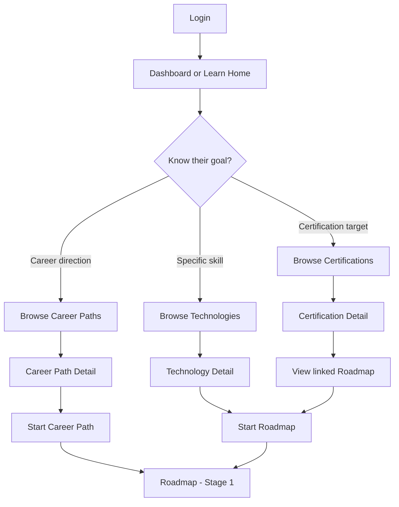
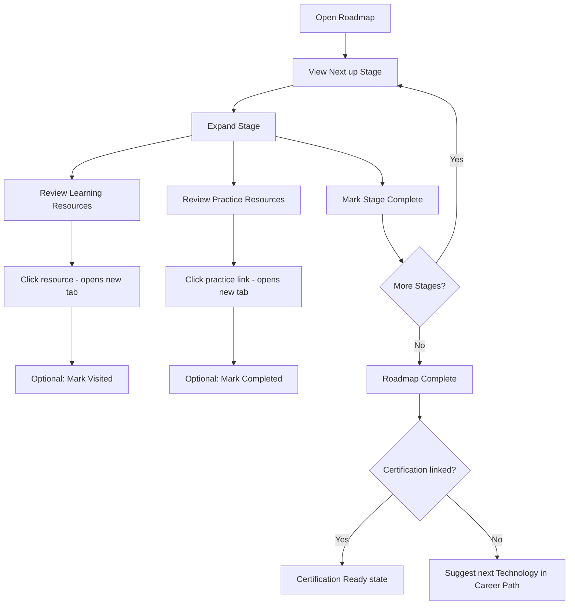
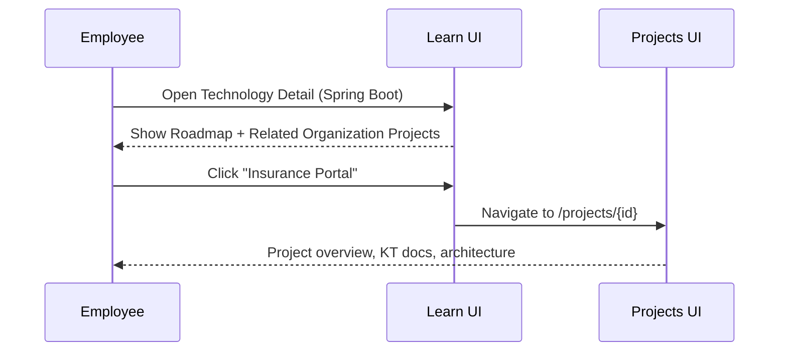
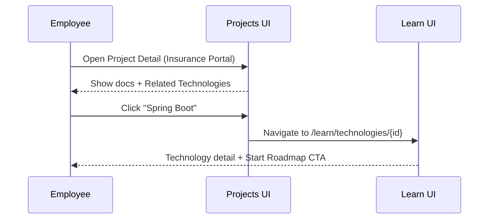
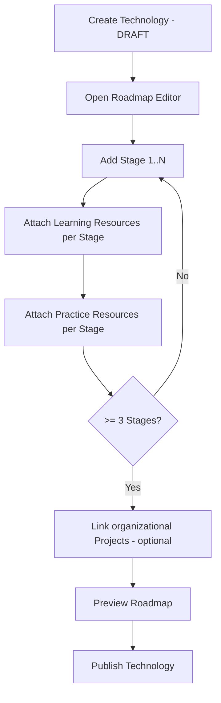

# v0.8.0 — User Flows

**Module:** Learn (+ cross-module navigation)  
**Status:** Design refinement v1.1 — draft for approval

---

## Flow index

| ID | Flow | Actor |
|----|------|-------|
| UF-E01 | First-time learner discovery | Employee |
| UF-E02 | Start Career Path | Employee |
| UF-E03 | Progress through Roadmap | Employee |
| UF-E04 | Pursue Certification | Employee |
| UF-E05 | My Journey management | Employee |
| UF-E06 | Initiative-aware learning | Employee |
| UF-E07 | Learn → Projects cross-navigation | Employee |
| UF-E08 | Projects → Learn cross-navigation | Employee |
| UF-A01 | Create Career Path | Admin |
| UF-A02 | Build Technology Roadmap | Admin |
| UF-A03 | Curate Learning & Practice Resources | Admin |
| UF-A04 | Publish content | Admin |
| UF-A05 | Link Technology to organizational Projects | Admin |
| UF-A06 | Link Initiative to Certification | Admin |

---

## Employee flows

### UF-E01 — First-time learner discovery

**Goal:** Employee finds a learning direction without prior context.



**Success:** Employee reaches Roadmap Stage 1 with an active enrollment.

---

### UF-E02 — Start Career Path

**Goal:** Employee enrolls in a Career Path and begins the first Technology.

**Steps:**

1. Employee views Career Path detail — ordered Technology list with difficulty and estimates.
2. Employee clicks **Start Career Path**.
3. System creates Career Path enrollment and auto-enrolls in first required Technology.
4. Employee lands on that Technology's Roadmap at Stage 1.

**Edge cases:**

| Case | Behaviour |
|------|-----------|
| Already enrolled | CTA shows **Continue** → resume at next incomplete Stage |
| Partial prior Technology progress | Existing progress reused (BR-C10) |
| All required Technologies complete | CTA shows **Completed** |

---

### UF-E03 — Progress through Roadmap

**Goal:** Employee completes Stages using Learning Resources and Practice Resources.



**UX notes:**

- Learning Resources and Practice Resources are separate lists within each Stage.
- Stage completion does not require completing all Resources.
- Practice Resource completion is independent of Stage completion.

---

### UF-E04 — Pursue Certification

**Goal:** Employee prepares for and records an industry certification.

**Steps:**

1. Discover Certification in Learn catalog.
2. View linked Roadmap and readiness criteria.
3. Enroll and complete Stages.
4. Readiness becomes **READY** → CTA to official provider (external).
5. After passing exam, submit via My Certifications.

---

### UF-E05 — My Journey management

**Goal:** Employee views and manages all learning activity.

**Steps:**

1. Open **My Journey** (`/learn/journey`).
2. View active, completed, and left enrollments.
3. Resume any active enrollment at next Stage.
4. Optionally **Leave** an enrollment (progress preserved).

---

### UF-E06 — Initiative-aware learning

**Goal:** Employee uses Initiative as motivation without dependency on it.

**Steps:**

1. View active Initiative with optional linked Certification.
2. Initiative detail shows Roadmap progress when linked.
3. Complete Roadmap in Learn independently of initiative deadline.
4. Submit Certificate to Initiative after external exam (optional).

**Key rule:** Initiative expiry does not affect Learn progress.

---

### UF-E07 — Learn → Projects cross-navigation

**Goal:** Employee discovers which organizational projects use a Technology they are learning.



**Steps:**

1. Employee is learning Spring Boot (Technology detail or Roadmap).
2. **Related Organization Projects** section lists linked projects (e.g., Insurance Portal, Employee Portal).
3. Employee clicks a project name.
4. Navigates to Projects module detail — views real organizational context.
5. Employee returns to Learn via browser back or **Related Technologies** on Project detail.

**Empty state:** "No linked organization projects" — Learn journey continues normally.

---

### UF-E08 — Projects → Learn cross-navigation

**Goal:** Employee onboarding to a project learns the Technologies that project uses.



**Steps:**

1. Employee opens organizational Project (e.g., Insurance Portal).
2. **Related Technologies** section lists linked Technologies.
3. Employee clicks a Technology.
4. Navigates to Learn Technology detail.
5. Employee may **Start Roadmap** to learn that Technology.

---

## Admin flows

### UF-A01 — Create Career Path

**Goal:** Admin defines a new professional direction.

**Steps:**

1. Learn → Manage → Career Paths → **Create**.
2. Fill metadata; add Technologies in order (required/elective).
3. Save as DRAFT → preview → publish when valid.

---

### UF-A02 — Build Technology Roadmap

**Goal:** Admin creates the Stage sequence for a Technology.



**Roadmap editor UX:**

- Left panel: Stage list (reorderable)
- Right panel: Stage detail with Learning Resources and Practice Resources tabs
- Technology editor: **Related Organization Projects** link management (separate from Stages)

---

### UF-A03 — Curate Learning & Practice Resources

**Goal:** Admin adds trusted external links to the resource library.

**Learning Resource steps:**

1. Manage → Resources → **Add Learning Resource**.
2. Enter title, URL, type, provider, free/paid.
3. Assign to Stage(s) via Roadmap editor.

**Practice Resource steps:**

1. Manage → Resources → **Add Practice Resource**.
2. Enter title, URL, type, difficulty, estimated time.
3. Assign to Stage(s) via Roadmap editor.

**Curation guidelines:**

| Resource type | Prefer |
|---------------|--------|
| Learning | Official docs, OER, vendor free training |
| Practice | Interactive labs, coding exercises, guided tutorials |

---

### UF-A04 — Publish content

**Pre-publish checklist:**

| Entity | Validation |
|--------|------------|
| Technology | ≥ 3 Stages; each Stage has ≥ 1 Learning Resource |
| Career Path | ≥ 2 Technologies; all required Technologies PUBLISHED |
| Certification | officialExamUrl present; ≥ 1 linked Technology |

Practice Resources are recommended but not required for publish in v1.

---

### UF-A05 — Link Technology to organizational Projects

**Goal:** Admin creates cross-navigation between Learn and Projects.

**Steps:**

1. Admin opens Technology editor (Learn Manage) **or** Project editor (Projects module).
2. In **Related Organization Projects** (or **Related Technologies**), search and add links.
3. Save — junction records created.
4. Employee sees links on both detail pages.

**Rules:**

- Links are optional
- Same junction data regardless of which module initiated the link
- Removing a link from either side removes the association

---

### UF-A06 — Link Initiative to Certification

**Goal:** Admin connects an Initiative to a Learn Certification (unchanged from v1.0 design).

**Steps:**

1. Edit Initiative → optional **Linked Certification** dropdown.
2. Save → Initiative detail shows Roadmap progress when linked.

---

## Cross-flow integration map

```text
                    ┌──────────────┐
                    │   Dashboard  │
                    └──────┬───────┘
                           │
         ┌─────────────────┼─────────────────┐
         │                 │                 │
  ┌──────▼──────┐   ┌──────▼──────┐   ┌──────▼──────┐
  │    Learn    │   │  Projects   │   │ Initiatives │
  │  (guidance) │◄─►│  (org KB)   │   │ (campaigns) │
  └──────┬──────┘   └─────────────┘   └──────┬──────┘
         │          cross-nav only            │
         │                                    │
         ▼                                    ▼
    Roadmap + Resources              Submit Certificate
         │                                    │
         └──────── Certifications ────────────┘
```

---

## Error and edge-case flows

| Scenario | User experience |
|----------|-----------------|
| Technology with no linked Projects | Empty state on Related Organization Projects |
| Project with no linked Technologies | Empty state on Related Technologies |
| Archived Technology | Read-only Roadmap; no new enrollments |
| Practice Resource link broken | Admin updates URL in resource library |
| Confusion between Practice Resource and Project | UI uses distinct labels; Practice Resource never called "Project" |

---

**Next document:** [05-roadmap.md](./05-roadmap.md)
