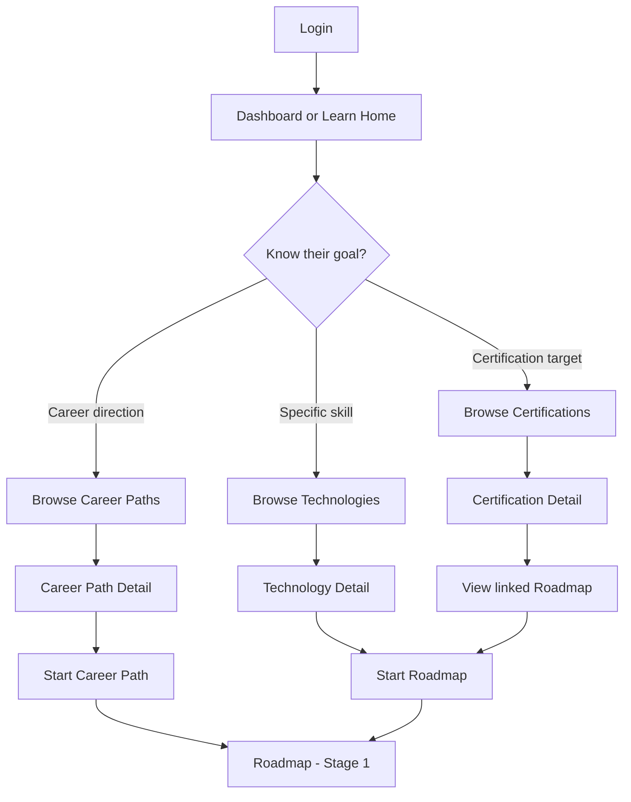
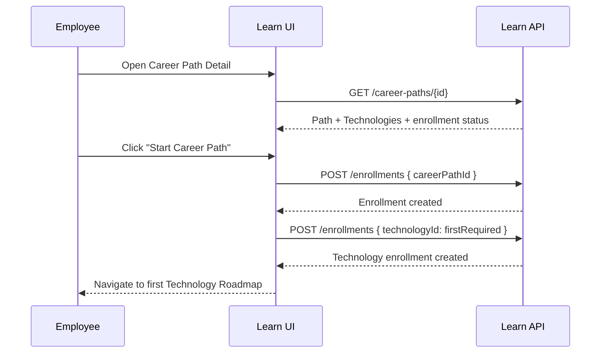
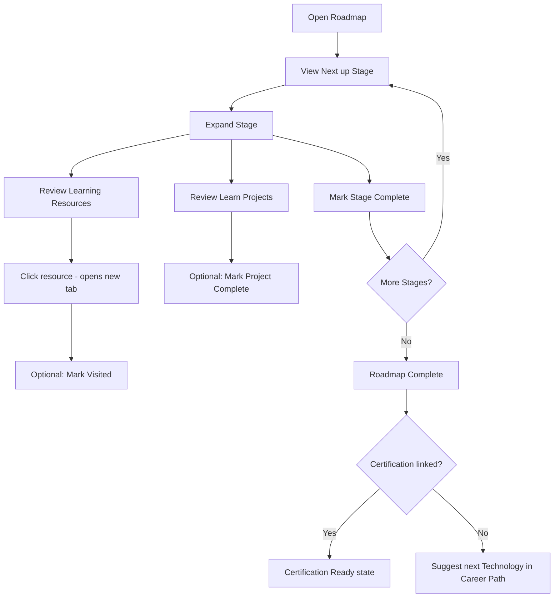
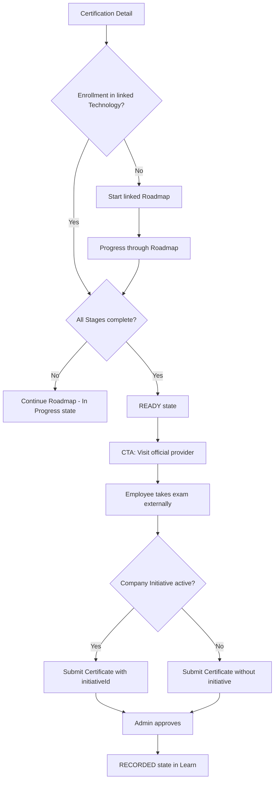
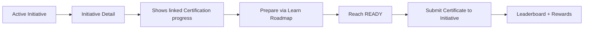
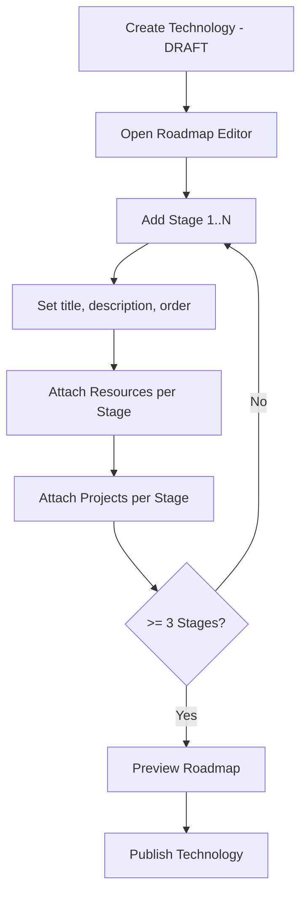

# v0.8.0 — User Flows

**Module:** Learn  
**Status:** Draft for approval

---

## Flow index

| ID | Flow | Actor |
|----|------|-------|
| UF-E01 | First-time learner discovery | Employee |
| UF-E02 | Start Career Path | Employee |
| UF-E03 | Progress through Roadmap | Employee |
| UF-E04 | Pursue Certification | Employee |
| UF-E05 | My Journey management | Employee |
| UF-E06 | Initiative-aware learning | Employee |
| UF-A01 | Create Career Path | Admin |
| UF-A02 | Build Technology Roadmap | Admin |
| UF-A03 | Curate Learning Resources | Admin |
| UF-A04 | Publish content | Admin |
| UF-A05 | Link Initiative to Certification | Admin |

---

## Employee flows

### UF-E01 — First-time learner discovery

**Goal:** Employee finds a learning direction without prior context.



**Steps:**

1. Employee logs in and lands on Dashboard.
2. Dashboard shows **Explore Learn** or **Continue Learning** (empty on first visit).
3. Employee clicks **Learn** in sidebar → Learn Home.
4. Learn Home presents three entry points: Career Paths, Technologies, Certifications.
5. Employee browses, reads descriptions, and selects an entry point.
6. Detail page provides **Start** CTA with clear expectations (time estimate, Stage count).

**Success:** Employee reaches Roadmap Stage 1 with an active enrollment.

**Empty state:** No published content → "Learning paths are being prepared."

---

### UF-E02 — Start Career Path

**Goal:** Employee enrolls in a Career Path and begins the first Technology.



**Steps:**

1. Employee views Career Path detail — sees ordered Technology list with difficulty and estimates.
2. Employee clicks **Start Career Path**.
3. System creates Career Path enrollment.
4. System auto-enrolls employee in the first **required** Technology (if not already enrolled).
5. Employee lands on that Technology's Roadmap at Stage 1.
6. **Next up** callout highlights Stage 1.

**Edge cases:**

| Case | Behaviour |
|------|-----------|
| Already enrolled | CTA shows **Continue** → resume at next incomplete Stage |
| Partial prior Technology progress | Existing Technology progress is reused (BR-C10) |
| All required Technologies complete | CTA shows **Completed** with celebration state |

---

### UF-E03 — Progress through Roadmap

**Goal:** Employee completes Stages, uses Resources, and finishes Projects.



**Steps:**

1. Employee opens Roadmap (from Continue Learning, My Journey, or Technology detail).
2. Progress bar shows `N / total` Stages complete.
3. **Next up** Stage is expanded by default.
4. Employee reviews Learning Resources — clicks open external content.
5. Optionally marks resources as visited (lightweight signal).
6. If Projects exist, employee reads brief and optionally completes externally.
7. Employee clicks **Mark Stage Complete** on the Stage.
8. System updates progress; next Stage becomes **Next up**.
9. On final Stage, Roadmap completion celebration appears.
10. If Certification is linked → readiness banner. If Career Path → prompt next Technology.

**UX notes:**

- Stage completion does not require visiting all Resources (self-paced trust model).
- Later Stages visible but show "Recommended after Stage N" soft label.
- Undo: employee can toggle Stage back to incomplete.

---

### UF-E04 — Pursue Certification

**Goal:** Employee prepares for and records an industry certification.



**Steps:**

1. Employee discovers Certification in catalog (or via Career Path / Technology).
2. Certification detail shows: provider, level, linked Roadmap, readiness indicator.
3. If not enrolled → **Start Roadmap** CTA.
4. Employee completes all Stages → readiness becomes **READY**.
5. Primary CTA: **Go to [Provider] exam page** (external link).
6. After passing exam, employee submits certificate via My Certifications.
7. On approval, Certification shows **Recorded** with approval date.

**Readiness states UI:**

| State | Badge | Primary CTA |
|-------|-------|-------------|
| Not Started | Grey | Start Roadmap |
| In Progress | Blue | Continue Roadmap |
| Ready | Green | Visit official provider |
| Recorded | Gold | View in My Certifications |

---

### UF-E05 — My Journey management

**Goal:** Employee views and manages all learning activity.

**Steps:**

1. Employee opens **My Journey** (`/learn/journey`).
2. Page shows:
   - **Active** enrollments (Career Paths and Technologies) with progress rings
   - **Next actions** per enrollment
   - **Completed** enrollments with completion dates
   - **Left** enrollments (collapsed section)
3. Employee clicks an active enrollment → resumes at Roadmap.
4. Employee may **Leave** an enrollment via overflow menu → confirm dialog.
5. Leaving preserves history; enrollment moves to Left section.

---

### UF-E06 — Initiative-aware learning

**Goal:** Employee uses Initiative as motivation layer without dependency.



**Steps:**

1. Employee sees active Initiative (e.g., "AWS Learning Challenge 2027").
2. Initiative detail shows linked Certification (if configured) and employee's Roadmap progress.
3. Employee clicks **Prepare for certification** → Learn Certification detail.
4. Employee completes Roadmap independently of initiative deadline.
5. When READY, employee takes external exam.
6. Employee returns to Initiative detail → **Submit Certificate** (existing flow).
7. Initiative leaderboard reflects submission; Learn progress unaffected by initiative expiry.

**Key rule:** If initiative expires before employee is READY, Learn journey continues unchanged.

---

## Admin flows

### UF-A01 — Create Career Path

**Goal:** Admin defines a new professional direction.

**Steps:**

1. Admin navigates to Learn → Manage → Career Paths.
2. Clicks **Create Career Path**.
3. Fills: title, description, estimated duration, icon.
4. Adds Technologies in order; marks each required or elective.
5. Saves as **DRAFT**.
6. Previews employee view.
7. Publishes when ≥ 2 Technologies and all are PUBLISHED (BR-LC05).

---

### UF-A02 — Build Technology Roadmap

**Goal:** Admin creates the Stage sequence for a Technology.



**Steps:**

1. Admin creates Technology (name, category, difficulty, description).
2. Opens Roadmap editor for that Technology.
3. Adds Stages with drag-to-reorder.
4. For each Stage: attach Resources from library or create inline.
5. For later Stages: attach Learn Projects.
6. Validates ≥ 3 Stages.
7. Previews employee Roadmap view.
8. Publishes Technology (publishes Roadmap with it).

**Roadmap editor UX:**

- Left panel: Stage list (reorderable)
- Right panel: selected Stage detail (metadata, resources, projects)
- Inline add Resource / Project without leaving editor

---

### UF-A03 — Curate Learning Resources

**Goal:** Admin adds trusted external links to the resource library.

**Steps:**

1. Admin opens Manage → Learning Resources (library).
2. Clicks **Add Resource**.
3. Enters: title, URL, type, provider, free/paid, estimated time.
4. System validates URL format (BR-R01).
5. Resource saved to library.
6. Admin assigns to Stage(s) via Roadmap editor.
7. Same resource may be reused across multiple Stages/Technologies.

**Curation guidelines (admin-facing help text):**

1. Prefer official documentation.
2. Prefer free and open resources.
3. Label paid content clearly.
4. Avoid login-walled resources when a free alternative exists.
5. Review links quarterly.

---

### UF-A04 — Publish content

**Goal:** Admin moves content from DRAFT to PUBLISHED.

**Pre-publish checklist (enforced by backend):**

| Entity | Validation |
|--------|------------|
| Technology | ≥ 3 Stages; each Stage has ≥ 1 Resource |
| Career Path | ≥ 2 Technologies; all required Technologies PUBLISHED |
| Certification | officialExamUrl present; ≥ 1 linked Technology |
| Learn Project | title, description, difficulty present |

**Steps:**

1. Admin reviews draft content in preview mode.
2. Clicks **Publish** → confirmation dialog summarizing visibility impact.
3. Backend validates publish rules.
4. On success: status chip → PUBLISHED; snackbar confirmation.
5. Content appears in employee browse surfaces within refresh.

**Archive flow:**

1. Admin clicks **Archive** on published content.
2. Confirmation: "Existing learners retain read-only access. New enrollments blocked."
3. Content hidden from browse; enrollments frozen for new sign-ups.

---

### UF-A05 — Link Initiative to Certification

**Goal:** Admin connects an existing Initiative to a Learn Certification.

**Steps:**

1. Admin opens Initiative edit (existing v0.7.1 flow).
2. New optional field: **Linked Certification** (searchable dropdown from Learn catalog).
3. Saves initiative metadata.
4. Initiative detail (employee) now shows Certification progress card.
5. Certification detail (employee) shows active Initiative banner when initiative is ACTIVE and visible.

**Unlink:** Clear the field → Initiative reverts to v0.7.1 behaviour.

---

## Cross-flow integration map

```text
                    ┌──────────────┐
                    │   Dashboard  │
                    └──────┬───────┘
                           │ Continue Learning
                    ┌──────▼───────┐
              ┌─────│     Learn    │─────┐
              │     └──────────────┘     │
     Career Paths                  Certifications
              │                           │
              ▼                           ▼
         Technology ◄──── linked ──── Certification
              │
              ▼
           Roadmap
              │
         Stage → Resources (external)
              │
         Stage → Learn Projects
              │
              ▼
         READY ──► Official Provider (external)
              │
              ▼
      My Certifications ◄── optional ── Initiatives
```

---

## Error and edge-case flows

| Scenario | User experience |
|----------|-----------------|
| External link broken | Employee reports (future); admin updates Resource URL |
| Archived Technology mid-journey | Read-only Roadmap; banner: "This Technology has been archived" |
| Leave and re-enroll | New enrollment; option to view prior progress history |
| Dual-role admin | Sees Manage tab + personal My Journey |
| No linked Certification on Initiative | Standard v0.7.1 initiative experience |
| Submit Certificate without initiative | Existing flow unchanged at `/submissions/new` |

---

**Next document:** [05-roadmap.md](./05-roadmap.md)
