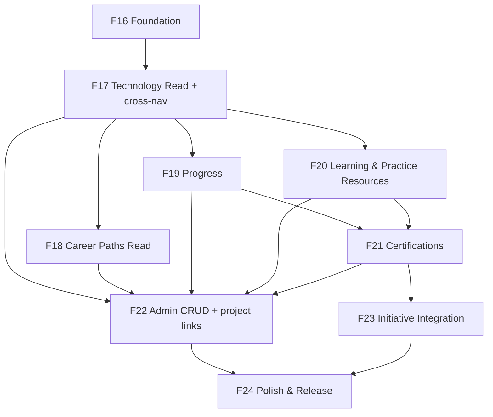

# v0.8.0 — Implementation Roadmap

**Module:** Learn (+ cross-module references to Projects)  
**Status:** Design refinement v1.1 — implementation begins only after product design approval  
**Feature numbering:** F16+ (continues from F15 Delete Initiative)

---

## Release overview

| Attribute | Value |
|-----------|-------|
| Release | v0.8.0 |
| Theme | Learn — Learning Guidance Platform |
| Phases | F16–F24 (9 phases) |
| Depends on | v0.7.1 (complete) |
| Schema migrations | Expected from F16/F17 onward |
| Breaking changes | None to existing APIs; navigation label changes only |

**Module boundary:** Learn does not own Projects. F20 delivers **Practice Resources** (external links), not Learn Projects. Cross-navigation to the Projects module is optional and read-only.

---

## Phase summary

| Phase | ID | Theme | Primary deliverable | Depends on |
|-------|-----|-------|---------------------|------------|
| 0 | F16 | Foundation | Routes, nav, types, API stubs, domain schema | v0.7.1 |
| 1 | F17 | Technology & Roadmap (read) | Employee browse Technology, view Roadmap, cross-nav to Projects | F16 |
| 2 | F18 | Career Paths (read) | Browse and detail Career Paths | F17 |
| 3 | F19 | Progress & Journey | Enrollment, Stage completion, My Journey | F17 |
| 4 | F20 | Learning & Practice Resources | Learning Resources and Practice Resources on Stages | F17 |
| 5 | F21 | Certification catalog | Certification browse, readiness, external CTAs | F19, F20 |
| 6 | F22 | Admin content management | Full CRUD for Learn entities + Technology ↔ Project links | F17–F21 |
| 7 | F23 | Initiative integration | Optional Certification link on Initiatives | F21 |
| 8 | F24 | Dashboard, nav polish & release | Widgets, renames, cross-nav polish, QA, release notes | All |

---

## F16 — Learn Foundation

**Goal:** Establish Learn module skeleton without employee-facing content.

### Backend

| Deliverable | Detail |
|-------------|--------|
| Package `com.company.learninghub.learn` | Controller, service, domain, dto, mapper, repository |
| Flyway migration | Core tables: `learn_technologies`, `learn_roadmaps`, `learn_roadmap_stages`, `learn_career_paths`, `learn_career_path_technologies`, `learn_learning_resources`, `learn_practice_resources`, `learn_certifications`, `learn_certification_technologies`, junction tables, `learn_technology_project_links` |
| Seed data (dev only) | Optional test fixtures — not production content |

### Frontend

| Deliverable | Detail |
|-------------|--------|
| `learnApi.ts`, `types/learn.ts` | API client and types |
| Routes under `/learn/*` | Placeholder pages with PageHeader |
| Sidebar update | Add Learn (position 2); **retain Projects (position 3)**; rename labels per BR-UX01/02 |
| Learn layout | Tab navigation component |
| Settings page shell | `/settings` with demoted Study Materials link |

### Exit criteria

- [ ] `/learn` loads for authenticated users
- [ ] Projects remains in sidebar as independent module (not under Learn)
- [ ] Admin sees Manage tab; employee does not
- [ ] Migrations apply cleanly

---

## F17 — Technology & Roadmap (Read)

**Goal:** Employees browse Technologies, view Roadmap, and see linked organizational Projects.

### Backend

| Deliverable | Detail |
|-------------|--------|
| `GET /api/v1/learn/technologies` | Paginated list; search, category, difficulty filters |
| `GET /api/v1/learn/technologies/{id}` | Detail with Roadmap summary + **related organization projects** (read) |
| `GET /api/v1/learn/technologies/{id}/roadmap` | Full Roadmap with ordered Stages |
| `learn_technology_project_links` | Junction to existing `projects` table (FK only; Projects module owns project data) |
| Employee visibility | PUBLISHED only; DRAFT → 404 for employees |

### Frontend

| Deliverable | Detail |
|-------------|--------|
| `TechnologyListPage` | Search, filter, cards |
| `TechnologyDetailPage` | Metadata, Roadmap CTA, **Related Organization Projects** section |
| `RoadmapPage` | Stage stepper (read-only); no progress yet |
| Cross-nav | Click project → navigate to `/projects/{id}` |

### Exit criteria

- [ ] Employee browses and opens a Roadmap
- [ ] Technology detail shows linked organizational Projects (or empty state)
- [ ] Cross-nav opens Projects module (no embedded Project content in Learn)
- [ ] Draft content hidden from employees

---

## F18 — Career Paths (Read)

**Goal:** Employees discover and explore Career Paths.

(Unchanged from v1.0 design.)

### Exit criteria

- [ ] Career Path detail shows ordered Technologies
- [ ] Learn Home surfaces featured paths

---

## F19 — Progress & Journey

**Goal:** Employees enroll, complete Stages, and view My Journey.

### Backend

| Deliverable | Detail |
|-------------|--------|
| `learn_learning_enrollments` table | userId, careerPathId?, technologyId, status, enrolledAt |
| `learn_stage_progress` table | enrollmentId, stageId, status, completedAt |
| Enrollment and progress APIs | Per BR-PR01 through BR-PR10 |

### Exit criteria

- [ ] Enroll → complete Stage → progress persists
- [ ] My Journey shows all enrollments
- [ ] Shared Technology progress across Career Paths (BR-C10)

---

## F20 — Learning & Practice Resources

**Goal:** Stages display curated Learning Resources and Practice Resources; employees interact externally.

> **Not in scope:** Learn Projects, project_progress, or any Project ownership in Learn.

### Backend

| Deliverable | Detail |
|-------------|--------|
| `GET` Roadmap responses include | Stage Learning Resources and Practice Resources |
| `learn_resource_visits` table (optional) | Track visited learning resources |
| `learn_practice_resource_progress` table (optional) | Self-reported practice completion |
| URL validation | BR-LR01 / BR-PA01 |
| Learning Resource types | OFFICIAL_DOCS, OER, OFFICIAL_TRAINING, ARTICLE, VIDEO, PAID |
| Practice Resource types | LAB, CODING_EXERCISE, GUIDED_TUTORIAL, SANDBOX |

### Frontend

| Deliverable | Detail |
|-------------|--------|
| Stage Learning Resource list | Type badges, free/paid, external link |
| Stage Practice Resource list | Difficulty, time estimate, external link — labeled **Practice Resource** |
| Mark Visited / Mark Completed | Toggle actions |
| Terminology | Never label Practice Resources as "Project" |

### Exit criteria

- [ ] Learning Resources and Practice Resources display in separate Stage sections
- [ ] All links open in new tab
- [ ] Paid badge visible where applicable
- [ ] No `/learn/projects` routes exist

---

## F21 — Certification Catalog

**Goal:** Employees browse Certifications and see readiness based on progress.

(Unchanged from v1.0 design.)

### Exit criteria

- [ ] Readiness transitions: NOT_STARTED → IN_PROGRESS → READY
- [ ] External exam link opens in new tab

---

## F22 — Admin Content Management

**Goal:** Admins fully manage Learn catalog content and Technology ↔ Project cross-links.

### Backend

| Deliverable | Detail |
|-------------|--------|
| CRUD `/api/v1/learn/manage/career-paths` | Admin only |
| CRUD `/api/v1/learn/manage/technologies` | Admin only |
| CRUD `/api/v1/learn/manage/roadmaps/{technologyId}/stages` | Reorder, create, update, delete |
| CRUD `/api/v1/learn/manage/learning-resources` | Learning Resource library |
| CRUD `/api/v1/learn/manage/practice-resources` | Practice Resource library |
| CRUD `/api/v1/learn/manage/certifications` | Certification catalog |
| `POST/DELETE .../technologies/{id}/project-links` | Link/unlink organizational Projects (FK to `projects`) |
| Publish / Archive actions | Dedicated POST endpoints |

> **Explicitly excluded:** `/api/v1/learn/manage/projects` — Projects are managed in the Projects module.

### Frontend

| Deliverable | Detail |
|-------------|--------|
| Admin list pages | Reuse Initiative list patterns |
| Roadmap editor | Stage list + Learning/Practice Resource tabs |
| Technology editor | **Related Organization Projects** link picker |
| Publish/Archive confirm dialogs | `ConfirmActionDialog` pattern |

### Exit criteria

- [ ] Full Learn content lifecycle: create → publish → archive
- [ ] Admin can link Technologies to organizational Projects
- [ ] No Learn admin UI for creating organizational Projects
- [ ] Practice Resources managed separately from Learning Resources

---

## F23 — Initiative Integration

**Goal:** Optionally link Initiatives to Certifications; show cross-module progress.

(Unchanged from v1.0 design.)

### Exit criteria

- [ ] Unlinked initiatives unchanged (regression)
- [ ] Learn works with zero linked initiatives

---

## F24 — Dashboard, Navigation Polish & Release

**Goal:** Complete v0.8.0 MVP and release readiness.

### Deliverables

| Area | Detail |
|------|--------|
| Dashboard widgets | Continue Learning, Featured Path, Certification Readiness |
| Navigation | Final label renames; **Projects retained in primary nav**; demote Study Materials to Settings |
| Cross-navigation polish | Related Organization Projects (Learn) + Related Technologies (Projects detail, if Projects UI available) |
| Learn Home | Complete discovery experience |
| Seed content | ≥ 3 Career Paths, ≥ 10 Technologies, ≥ 10 Certifications, Practice Resources per Stage |
| Documentation | `docs/releases/release-v0.8.0.md`, update `project-roadmap.md` |
| Manual QA checklist | Include UF-E07, UF-E08 cross-nav flows |

### Exit criteria

- [ ] All F16–F23 exit criteria met
- [ ] Learn and Projects module separation verified in QA
- [ ] No regression on Initiatives, Certificates, Users, Leaderboards, Projects routes
- [ ] Manual QA sign-off

---

## Dependency graph

---

## Schema migration plan (indicative)

| Migration | Phase | Tables |
|-----------|-------|--------|
| V12__create_learn_core.sql | F16 | learn_technologies, learn_roadmaps, learn_roadmap_stages, learn_career_paths, learn_career_path_technologies |
| V13__create_learn_resources.sql | F16 | learn_learning_resources, learn_stage_learning_resources, learn_practice_resources, learn_stage_practice_resources |
| V14__create_learn_certifications.sql | F16 | learn_certifications, learn_certification_technologies |
| V15__create_learn_cross_links.sql | F16/F17 | learn_technology_project_links (FK → projects) |
| V16__create_learn_progress.sql | F19 | learn_learning_enrollments, learn_stage_progress, learn_resource_visits, learn_practice_resource_progress |
| V17__initiative_certification_link.sql | F23 | learning_initiatives.linked_certification_id |

> Table prefix `learn_` avoids collision with existing `projects` and `study_materials` tables.

---

## Launch content plan

| Content | Minimum at launch | Owner |
|---------|-------------------|-------|
| Career Paths | 3 | L&D Admin |
| Technologies | 10 | Technical leads |
| Roadmap Stages | 30+ total | Technical leads |
| Learning Resources | 100+ curated links | Technical leads |
| Practice Resources | 30+ curated links | Technical leads |
| Technology ↔ Project links | 10+ cross-links | Engineering leads |
| Certifications | 10 | L&D Admin |

---

## Out of scope for v0.8.0 (deferred)

| Item | Target |
|------|--------|
| Learn owning or managing Projects | **Permanently out of scope** |
| Full Projects module UI build-out | Independent release (placeholder may remain) |
| Global Search | v0.9+ |
| Automated link checker | v0.8.1 |
| AI recommendations | v0.9+ |

---

## Risk register (implementation)

| Risk | Phase | Mitigation |
|------|-------|------------|
| Learn vs Projects confusion | F17, F24 | Independent nav; distinct labels; QA cross-nav flows |
| Practice Resource labeled "Project" | F20 | BR-PA03 terminology enforcement in UI copy review |
| Projects UI still placeholder | F24 | Cross-nav works; Projects detail may be minimal |
| Roadmap editor complexity | F22 | Split panel UX; separate resource type tabs |

---

**Next document:** [06-future-enhancements.md](./06-future-enhancements.md)
