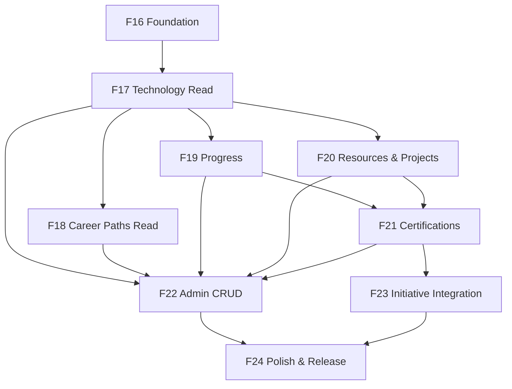

# v0.8.0 — Implementation Roadmap

**Module:** Learn  
**Status:** Draft for approval — implementation begins only after product design approval  
**Feature numbering:** F16+ (continues from F15 Delete Initiative)

---

## Release overview

| Attribute | Value |
|-----------|-------|
| Release | v0.8.0 |
| Theme | Learn — Learning Guidance Platform |
| Phases | F16–F24 (9 phases) |
| Depends on | v0.7.1 (complete) |
| Schema migrations | Expected from F16/F17 onward |
| Breaking changes | None to existing APIs; navigation label changes only |

---

## Phase summary

| Phase | ID | Theme | Primary deliverable | Depends on |
|-------|-----|-------|---------------------|------------|
| 0 | F16 | Foundation | Routes, nav, types, API stubs, domain schema | v0.7.1 |
| 1 | F17 | Technology & Roadmap (read) | Employee browse Technology, view Roadmap | F16 |
| 2 | F18 | Career Paths (read) | Browse and detail Career Paths | F17 |
| 3 | F19 | Progress & Journey | Enrollment, Stage completion, My Journey | F17 |
| 4 | F20 | Resources & Projects | Learning Resources, Learn Projects on Stages | F17 |
| 5 | F21 | Certification catalog | Certification browse, readiness, external CTAs | F19, F20 |
| 6 | F22 | Admin content management | Full CRUD for all Learn entities | F17–F21 |
| 7 | F23 | Initiative integration | Optional Certification link on Initiatives | F21 |
| 8 | F24 | Dashboard, nav polish & release | Widgets, renames, QA, docs, release notes | All |

---

## F16 — Learn Foundation

**Goal:** Establish module skeleton without employee-facing content.

### Backend

| Deliverable | Detail |
|-------------|--------|
| Package `com.company.learninghub.learn` | Controller, service, domain, dto, mapper, repository |
| Flyway migration | Core tables: `technologies`, `roadmaps`, `roadmap_stages`, `career_paths`, `career_path_technologies`, `learning_resources`, `learn_projects`, `certifications`, `certification_technologies`, junction tables |
| Seed data (dev only) | Optional Flyway seed or test fixtures — not production content |
| Health endpoints | Verify module wiring |

### Frontend

| Deliverable | Detail |
|-------------|--------|
| `learnApi.ts`, `types/learn.ts` | API client and types |
| Routes under `/learn/*` | Placeholder pages with PageHeader |
| Sidebar update | Add Learn (position 2); rename labels per BR-UX01/02 |
| Learn layout | Tab navigation component |
| Settings page shell | `/settings` with demoted module links |

### Exit criteria

- [ ] `/learn` loads for authenticated users
- [ ] Admin sees Manage tab; employee does not
- [ ] Sidebar matches approved IA
- [ ] Migrations apply cleanly
- [ ] Tests: route guards, API smoke, migration integration

---

## F17 — Technology & Roadmap (Read)

**Goal:** Employees can browse Technologies and view a published Roadmap.

### Backend

| Deliverable | Detail |
|-------------|--------|
| `GET /api/v1/learn/technologies` | Paginated list; search, category, difficulty filters |
| `GET /api/v1/learn/technologies/{id}` | Detail with Roadmap summary |
| `GET /api/v1/learn/technologies/{id}/roadmap` | Full Roadmap with ordered Stages |
| Employee visibility | PUBLISHED only; DRAFT → 404 for employees |
| Admin seed content | At least 2 Technologies with Roadmaps for QA |

### Frontend

| Deliverable | Detail |
|-------------|--------|
| `TechnologyListPage` | Search, filter, cards |
| `TechnologyDetailPage` | Metadata, view Roadmap CTA |
| `RoadmapPage` | Stage stepper (read-only); no progress yet |
| Empty/loading/error states | Per engineering standards |

### Exit criteria

- [ ] Employee browses and opens a Roadmap
- [ ] Stage stepper renders all Stages
- [ ] Draft content hidden from employees
- [ ] Responsive stepper (desktop/mobile)

---

## F18 — Career Paths (Read)

**Goal:** Employees discover and explore Career Paths.

### Backend

| Deliverable | Detail |
|-------------|--------|
| `GET /api/v1/learn/career-paths` | List with featured filter |
| `GET /api/v1/learn/career-paths/{id}` | Detail with ordered Technologies |
| Featured flag | `featured` boolean on Career Path |

### Frontend

| Deliverable | Detail |
|-------------|--------|
| `CareerPathListPage` | Cards with Technology count, estimated duration |
| `CareerPathDetailPage` | Technology list, descriptions |
| Learn Home | Featured Career Paths section |

### Exit criteria

- [ ] Career Path detail shows ordered Technologies
- [ ] Each Technology links to Technology detail
- [ ] Learn Home surfaces featured paths

---

## F19 — Progress & Journey

**Goal:** Employees enroll, complete Stages, and view My Journey.

### Backend

| Deliverable | Detail |
|-------------|--------|
| `learning_enrollments` table | userId, careerPathId?, technologyId, status, enrolledAt |
| `stage_progress` table | enrollmentId, stageId, status, completedAt |
| `POST /api/v1/learn/enrollments` | Create enrollment |
| `DELETE /api/v1/learn/enrollments/{id}` | Leave enrollment |
| `POST /api/v1/learn/stage-progress` | Mark complete/incomplete |
| `GET /api/v1/learn/journey` | Employee's enrollments and progress |
| Business rules | BR-PR01 through BR-PR10 |

### Frontend

| Deliverable | Detail |
|-------------|--------|
| Start Career Path / Start Roadmap CTAs | Create enrollment |
| Roadmap progress | Checkmarks, progress bar, Next up |
| `MyJourneyPage` | Active, completed, left enrollments |
| Continue Learning card | Learn Home component |

### Exit criteria

- [ ] Enroll → complete Stage → progress persists
- [ ] My Journey shows all enrollments
- [ ] Leave enrollment works with confirm dialog
- [ ] Shared Technology progress across Career Paths (BR-C10)

---

## F20 — Learning Resources & Learn Projects

**Goal:** Stages display curated Resources and Projects; employees interact externally.

### Backend

| Deliverable | Detail |
|-------------|--------|
| `GET` responses include | Stage Resources and Projects |
| `resource_visits` table (optional) | Track visited resources |
| `project_progress` table | Self-reported project completion |
| URL validation | BR-R01 on admin writes (F22) but read paths in F20 |
| Resource types enum | OFFICIAL_DOCS, OER, OFFICIAL_TRAINING, ARTICLE, VIDEO, PAID |

### Frontend

| Deliverable | Detail |
|-------------|--------|
| Stage Resource list | Type badges, free/paid, external link icon |
| Stage Project cards | Difficulty, time estimate, external link |
| Mark Visited / Mark Project Complete | Toggle actions |
| Roadmap read path | Full Stage content visible |

### Exit criteria

- [ ] Resources open in new tab
- [ ] Projects display on appropriate Stages
- [ ] Paid badge visible where applicable
- [ ] Mark complete toggles work

---

## F21 — Certification Catalog

**Goal:** Employees browse Certifications and see readiness based on progress.

### Backend

| Deliverable | Detail |
|-------------|--------|
| `GET /api/v1/learn/certifications` | List with provider, level filters |
| `GET /api/v1/learn/certifications/{id}` | Detail with linked Technologies |
| Readiness calculation | BR-CT04 derived from StageProgress |
| `GET /api/v1/learn/certifications/{id}/readiness` | Employee-specific readiness state |

### Frontend

| Deliverable | Detail |
|-------------|--------|
| `CertificationListPage` | Provider logos/badges (text in v1) |
| `CertificationDetailPage` | Readiness badge, linked Roadmap, external CTA |
| Ready state | Primary CTA to official provider |

### Exit criteria

- [ ] Readiness transitions: NOT_STARTED → IN_PROGRESS → READY
- [ ] External exam link opens in new tab
- [ ] Linked Roadmap navigation works

---

## F22 — Admin Content Management

**Goal:** Admins fully manage Learn catalog content.

### Backend

| Deliverable | Detail |
|-------------|--------|
| CRUD `/api/v1/learn/manage/career-paths` | Admin only |
| CRUD `/api/v1/learn/manage/technologies` | Admin only |
| CRUD `/api/v1/learn/manage/roadmaps/{technologyId}/stages` | Reorder, create, update, delete |
| CRUD `/api/v1/learn/manage/resources` | Resource library |
| CRUD `/api/v1/learn/manage/projects` | Learn Projects |
| CRUD `/api/v1/learn/manage/certifications` | Certification catalog |
| Publish / Archive actions | Dedicated POST endpoints (mirror Initiative lifecycle pattern) |
| Publish validation | BR-LC05, BR-C08, BR-CT02 |

### Frontend

| Deliverable | Detail |
|-------------|--------|
| Admin list pages | Reuse `InitiativeListPage` patterns |
| Create/Edit dialogs | Reuse `CreateInitiativeDialog` patterns |
| Roadmap editor | Stage list + detail split panel |
| Publish/Archive confirm dialogs | `ConfirmActionDialog` pattern |
| `LearnManagementSnackbar` | Success feedback |
| Preview mode | Admin views employee experience for DRAFT |

### Exit criteria

- [ ] Full content lifecycle: create → publish → archive
- [ ] Roadmap editor supports reorder and Stage CRUD
- [ ] Publish validation enforced server-side
- [ ] Admin-only guards on all manage routes

---

## F23 — Initiative Integration

**Goal:** Optionally link Initiatives to Certifications; show cross-module progress.

### Backend

| Deliverable | Detail |
|-------------|--------|
| Flyway migration | `learning_initiatives.linked_certification_id` nullable FK |
| Initiative DTO update | Include linked Certification summary |
| Initiative detail API | Include employee Roadmap progress when linked |
| No change to F14/F15 lifecycle rules | BR-IN03–IN06 |

### Frontend

| Deliverable | Detail |
|-------------|--------|
| Edit Initiative dialog | Optional Certification dropdown |
| Initiative detail | Progress card when linked |
| Certification detail | Active initiative banner when applicable |
| Submit Certificate | Contextual entry points |

### Exit criteria

- [ ] Link and unlink Certification on Initiative
- [ ] Progress visible on Initiative detail
- [ ] Unlinked initiatives unchanged (regression)
- [ ] Learn works with zero linked initiatives

---

## F24 — Dashboard, Navigation Polish & Release

**Goal:** Complete v0.8.0 MVP and release readiness.

### Deliverables

| Area | Detail |
|------|--------|
| Dashboard widgets | Continue Learning, Featured Path, Certification Readiness |
| Navigation | Final label renames; demote Study Materials / Projects to Settings |
| Learn Home | Complete discovery experience |
| Seed content | ≥ 3 Career Paths, ≥ 10 Technologies, ≥ 10 Certifications |
| Documentation | `docs/releases/release-v0.8.0.md`, update `project-roadmap.md` |
| Self-QA | Full regression per engineering standards |
| Manual QA checklist | Employee + admin flows from `04-user-flows.md` |

### Exit criteria

- [ ] All F16–F23 exit criteria met
- [ ] No regression on Initiatives, Certificates, Users, Leaderboards
- [ ] Frontend build + tests pass
- [ ] Backend tests pass for learn module
- [ ] Manual QA sign-off
- [ ] Release notes published

---

## Dependency graph

**Parallelization opportunity:** F18 and F19 can proceed in parallel after F17. F20 can start alongside F19.

---

## Schema migration plan (indicative)

| Migration | Phase | Tables |
|-----------|-------|--------|
| V12__create_learn_core.sql | F16 | technologies, roadmaps, roadmap_stages, career_paths, career_path_technologies |
| V13__create_learn_content.sql | F16 | learning_resources, stage_resources, learn_projects, stage_projects |
| V14__create_learn_certifications.sql | F16 | certifications, certification_technologies |
| V15__create_learn_progress.sql | F19 | learning_enrollments, stage_progress, resource_visits, project_progress |
| V16__initiative_certification_link.sql | F23 | learning_initiatives.linked_certification_id |

> Exact migration split may be consolidated during implementation. Numbers are indicative.

---

## Testing strategy per phase

| Phase | Backend tests | Frontend tests |
|-------|---------------|----------------|
| F16 | Migration integration, route security | Route rendering, role guards |
| F17 | Service visibility, list/filter, 404 draft | List, detail, roadmap render |
| F18 | Career Path ordering, featured | List, detail navigation |
| F19 | Enrollment rules, progress, leave | CTA flows, My Journey |
| F20 | URL validation, resource attachment | External links, toggles |
| F21 | Readiness calculation | Readiness badges, CTAs |
| F22 | Publish validation, CRUD auth | Admin dialogs, editor |
| F23 | FK integrity, unlinked regression | Cross-module cards |
| F24 | Full suite regression | Dashboard widgets, E2E paths |

---

## Launch content plan

Admin team prepares launch catalog in parallel with F22:

| Content | Minimum at launch | Owner |
|---------|-------------------|-------|
| Career Paths | 3 (Cloud Engineer, Backend Developer, DevOps Engineer) | L&D Admin |
| Technologies | 10 | Technical leads |
| Roadmap Stages | 30+ total | Technical leads |
| Learning Resources | 100+ curated links | Technical leads |
| Learn Projects | 15+ | Technical leads |
| Certifications | 10 (AWS CLF, AZ-900, CKA, etc.) | L&D Admin |

---

## Out of scope for v0.8.0 (deferred)

| Item | Target |
|------|--------|
| Global Search | v0.9+ |
| Automated link checker | v0.8.1 |
| Learn leaderboards | v0.9+ |
| AI recommendations | v0.9+ (see 06-future-enhancements.md) |
| Certificate submission ↔ Certification FK | F23 or v0.8.1 |
| Study Materials integration | v0.9+ |
| Email notifications for Learn milestones | v0.9+ |
| Manager dashboards | Not planned (role simplicity) |
| Multiple Roadmaps per Technology | v0.9+ |

---

## Risk register (implementation)

| Risk | Phase | Mitigation |
|------|-------|------------|
| Roadmap editor complexity | F22 | Split panel UX; incremental Stage CRUD |
| Large F22 scope | F22 | Consider F22a (Technology/Roadmap admin) and F22b (rest) if needed |
| Content not ready at F24 | F24 | Seed in dev from F17; content workstream parallel |
| Initiative FK migration | F23 | Nullable column; backward compatible |
| Navigation rename confusion | F24 | Release comms; tooltip on first visit (optional) |

---

## Approval checkpoint

| Gate | Required before |
|------|-----------------|
| Product design approval | F16 start |
| F17 demo review | F19 start |
| Admin editor UX review | F22 start |
| Content sign-off | F24 release |
| Manual QA sign-off | v0.8.0 tag |

---

**Next document:** [06-future-enhancements.md](./06-future-enhancements.md)
