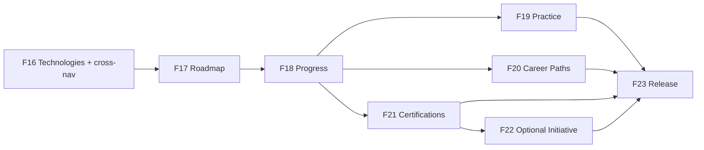

# v0.8.0 — Implementation Roadmap (Summary)

**Status:** **FINAL — frozen**  
**Product design:** Approved v1.1 (frozen)  
**Feature numbering:** F16–F23 (8 phases)

> **Authoritative detail:** [07-implementation-plan.md](./07-implementation-plan.md)

---

## Phase overview

| Phase | Name | Complexity |
|-------|------|------------|
| **F16** | Technology Discovery & Search *(incl. Projects cross-nav)* | M |
| **F17** | Roadmap & Learning Resources | L |
| **F18** | Progress & Learning Journey | L |
| **F19** | Practice Resources | M |
| **F20** | Career Paths | M |
| **F21** | Industry Certifications | M |
| **F22** | Optional Initiative Association | S |
| **F23** | Dashboard, Unified Search & Release | M |

---

## Key refinements (final)

| Change | Resolution |
|--------|------------|
| Standalone F22 cross-navigation phase | **Removed** — merged into **F16** (relationship, not a feature) |
| "Initiative Integration" naming | Renamed **F22 — Optional Initiative Association** |
| F24 release phase | Renumbered to **F23** (8 phases total) |
| Four-questions UX principle | Added to implementation guidance |
| Rule-based recommendations | Documented as future (not AI); out of v0.8.0 scope |
| Admin–employee parity | Explicit table per phase in plan |

---

## Guiding principles

1. Vertical slices — employee + admin together each phase  
2. Technologies first; Career Paths complement (F20)  
3. Search: list F16, unified F23  
4. **Four questions every page:** Where am I? What is this? What should I do next? Where do I go next?  
5. Projects independent — cross-nav in F16 only  
6. Learn never depends on Initiatives (F22 optional association)

---

## Dependency graph

---

## Flyway (incremental)

| Migration | Phase |
|-----------|-------|
| V12 — technologies + project links | F16 |
| V13 — roadmaps, learning resources | F17 |
| V14 — progress | F18 |
| V15 — practice resources | F19 |
| V16 — career paths | F20 |
| V17 — certifications | F21 |
| V18 — initiative certification link | F22 |

---

## Approval

| Gate | Status |
|------|--------|
| Product design v1.1 | **Approved — frozen** |
| Implementation plan | **FINAL — frozen** |
| F16 coding | After formal sign-off |
