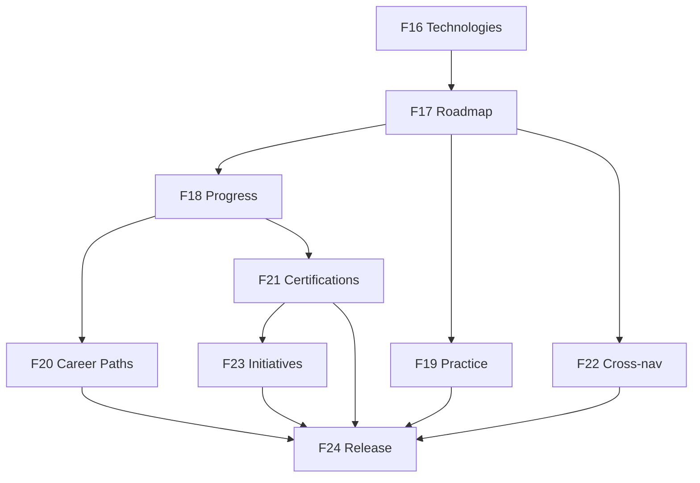

# v0.8.0 — Implementation Roadmap (Summary)

**Status:** Implementation plan finalized — pending approval (`07-implementation-plan.md`)  
**Product design:** Approved v1.1 (frozen)  
**Feature numbering:** F16–F24

> **Authoritative detail:** Every phase objective, scope, backend/frontend work, validation, business rules, tests, QA, risks, dependencies, and acceptance criteria are in **[07-implementation-plan.md](./07-implementation-plan.md)**.

---

## Release overview

| Attribute | Value |
|-----------|-------|
| Release | v0.8.0 |
| Theme | Learn — Learning Guidance Platform |
| Phases | F16–F24 (9 vertical slices) |
| Depends on | v0.7.1 (complete) |
| First phase | F16 — Technology Discovery & Search |

---

## Why the roadmap was reorganized

| Prior issue | Resolution |
|-------------|------------|
| F16 foundation-only (no user value) | F16 is first **vertical slice** (employee browse + admin create) |
| Read-only slices before admin write | Admin paired with each entity from F16 |
| Career Paths before Progress | Progress (F18) before Career Paths (F20) |
| Monolithic F22 admin | Admin CRUD distributed F16–F21 |
| Search deferred | Technology search F16; unified Learn search F24 |

---

## Phase summary

| Phase | Name | Shippable value | Complexity |
|-------|------|-----------------|------------|
| **F16** | Technology Discovery & Search | Browse/search Technologies; admin create/publish | M |
| **F17** | Roadmap & Learning Resources | Full guided Roadmap with study links | L |
| **F18** | Progress & Learning Journey | Enroll, Stage progress, My Journey, Next up | L |
| **F19** | Practice Resources | External hands-on links on Stages | M |
| **F20** | Career Paths | Multi-technology paths (complement) | M |
| **F21** | Industry Certifications | Catalog, readiness, provider CTA | M |
| **F22** | Projects Cross-Navigation | Technology ↔ Project links only | S |
| **F23** | Initiative Integration | Optional Certification on Initiative | S |
| **F24** | Dashboard, Unified Search & Release | Widgets, search, polish, release | M |

---

## Guiding principles

1. **Vertical slices** — each phase delivers visible business value  
2. **Technologies first** — Career Paths complement in F20  
3. **Search first-class** — list search F16; unified search F24  
4. **Progress grows** — F18 enrollment → F21 readiness  
5. **Projects independent** — cross-nav only in F22  
6. **Never wonder what's next** — every phase ships a next-step affordance  

---

## Dependency graph

---

## Flyway migrations (incremental)

| Migration | Phase |
|-----------|-------|
| V12 — technologies | F16 |
| V13 — roadmaps, learning resources | F17 |
| V14 — progress | F18 |
| V15 — practice resources | F19 |
| V16 — career paths | F20 |
| V17 — certifications | F21 |
| V18 — technology ↔ project links | F22 |
| V19 — initiative certification link | F23 |

---

## Approval gate

| Document | Status |
|----------|--------|
| Product design v1.1 | **Approved — frozen** |
| Implementation plan (`07-implementation-plan.md`) | **Pending approval** |
| F16 coding | **Blocked until plan approved** |

---

**Detailed plan:** [07-implementation-plan.md](./07-implementation-plan.md)  
**Product design:** [00-product-design.md](./00-product-design.md)  
**Business rules:** [03-business-rules.md](./03-business-rules.md)
