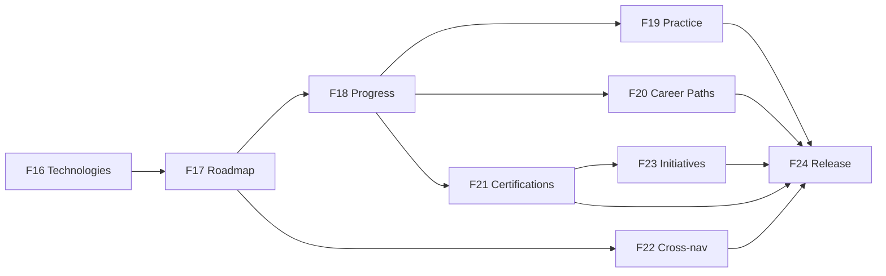

# v0.8.0 Learn Module — Implementation Plan

**Status:** Finalized for approval — **architecture frozen (design v1.1)**  
**Feature numbering:** F16–F24 (continues from F15)  
**Depends on:** v0.7.1 Initiative Management (complete)  
**Classification:** Implementation planning only — **no production code in this document**

---

## Document purpose

This is the authoritative implementation plan for v0.8.0 Learn. It follows the same engineering process used for Initiative Management (F11–F15): each phase is independently implementable, testable, reviewable, and releasable.

**Product design reference:** `docs/v0.8.0/00-product-design.md` (approved v1.1, frozen)  
**Business rules reference:** `docs/v0.8.0/03-business-rules.md`

---

## Implementation guiding principles

### Engineering principles (from `.cursor/engineering-standards.md`)

1. **Vertical slices over horizontal layers** — every phase ships employee-visible and/or admin-usable value.
2. **Correctness before speed** — backend enforces business rules; frontend mirrors for fast feedback.
3. **Reuse before create** — follow `InitiativeListPage`, `CreateInitiativeDialog`, `ConfirmActionDialog`, `*Messages.ts`, `*FormState.ts` patterns.
4. **Minimal scope** — implement only the approved phase; no AI, no LMS features, no Projects ownership in Learn.
5. **Independently releasable** — each phase can merge without waiting for a future phase.

### Learn-specific principles

| Principle | Implementation implication |
|-----------|---------------------------|
| **Technologies are primary** | First employee slice is Technology browse/search; Career Paths come later as a complement |
| **Search is first-class** | Technology list search in F16; unified Learn search in F24; URL-synced query params throughout |
| **Progress grows incrementally** | F18 adds enrollment/progress; F21 adds certification readiness; each phase adds guidance layers |
| **Practice Resources are external links** | Never labeled "Project"; separate tables and UI sections from Learning Resources |
| **Certifications ≠ Initiatives** | Certification catalog in Learn (F21); Initiative link deferred to F23 |
| **Projects stay independent** | Cross-navigation only in F22; no `/learn/projects` routes |
| **A learner should never wonder what to do next** | Every phase ships a **Next step** affordance: Stage 1 CTA (F17), Next up (F18), Continue Learning (F18+), readiness CTAs (F21) |

### UX principle (mandatory)

> **"A learner should never wonder what to do next."**

Every completed feature must guide users to the next logical learning step:

| Phase | Next-step affordance |
|-------|---------------------|
| F16 | Technology detail → **View Roadmap** |
| F17 | Roadmap → **Start with Stage 1** / expand first Stage |
| F18 | **Next up** Stage; **Continue Learning** on Learn home |
| F19 | Stage lists show **Practice Resources** after Learning Resources |
| F20 | Career Path detail → **Start with first Technology** |
| F21 | Certification → **Continue Roadmap** or **Visit official provider** when READY |
| F24 | Dashboard **Continue Learning** widget |

---

## Roadmap revision summary

The prior proposal (all schema in F16, read-only employee slices before admin, monolithic F22 admin) was **reorganized**:

| Issue in prior plan | Resolution |
|---------------------|------------|
| F16 foundation-only (no user value) | **Eliminated** — F16 is first vertical slice (Technology discovery + admin create) |
| Employee read long before admin write | **Admin write paired** with each employee slice from F16 onward |
| Career Paths before Progress (F18 before F19) | **Reordered** — Progress (F18) before Career Paths (F20) |
| Monolithic F22 admin CRUD | **Split** — admin CRUD distributed across F16–F21 per entity |
| Search deferred to v0.9 | **Elevated** — list search F16; unified Learn search F24 |
| Learning Resources separate from Roadmap (F20 after F17) | **Merged** — F17 delivers Roadmap + Learning Resources together |

---

## Phase overview

| Phase | Name | Employee value | Admin value | Complexity |
|-------|------|----------------|-------------|------------|
| **F16** | Technology Discovery & Search | Browse/search Technologies | Create/edit/publish Technology | **M** |
| **F17** | Roadmap & Learning Resources | View Roadmap, Stages, study links | Roadmap editor, Learning Resource curation | **L** |
| **F18** | Progress & Learning Journey | Enroll, complete Stages, My Journey | — (progress is employee-only) | **L** |
| **F19** | Practice Resources | Hands-on external links on Stages | Practice Resource curation | **M** |
| **F20** | Career Paths | Browse/start Career Paths | Career Path CRUD | **M** |
| **F21** | Industry Certifications | Catalog, readiness, provider CTA | Certification CRUD | **M** |
| **F22** | Projects Cross-Navigation | Related Organization Projects | Technology ↔ Project links | **S** |
| **F23** | Initiative Integration | Initiative ↔ Certification progress | Link Certification on Initiative | **S** |
| **F24** | Dashboard, Unified Search & Release | Dashboard widgets, Learn home polish | Settings shell; release readiness | **M** |

**Total phases:** 9 (F16–F24)  
**Flyway migrations:** Incremental per phase (no big-bang schema)



---

## Shared conventions (all phases)

### Backend package

```text
com.company.learninghub.learn/
├── controller/
├── domain/
├── dto/
├── mapper/
├── repository/
└── service/
```

### Frontend structure

```text
frontend/src/
├── api/learnApi.ts
├── types/learn.ts
├── pages/learn/
├── components/learn/
│   ├── learnMessages.ts
│   ├── learnFormState.ts
│   └── learnListParams.ts
```

### API base path

`/api/v1/learn/...` — employee read paths  
`/api/v1/learn/manage/...` — admin write paths

### Content status enum

`DRAFT` | `PUBLISHED` | `ARCHIVED` — employees see `PUBLISHED` only (404 for draft)

### Standard PR deliverables (each phase)

1. Files changed  
2. Tests added/updated  
3. Test results  
4. Build results  
5. Risks/issues  
6. Acceptance checklist  
7. Manual QA checklist  

---

# F16 — Technology Discovery & Search

## Objective

Deliver the first usable Learn vertical slice: employees browse and search Technologies; admins create and publish Technologies. Establishes Learn navigation, module shell, and search-first Technology browsing.

## Scope

First end-to-end Learn capability centered on **Technologies as the primary entry point**.

## In scope

- Sidebar navigation update (Learn position 2, Projects position 3, label renames)
- Learn module shell: routes, tab navigation, `PageHeader` pages
- `learnApi.ts`, `types/learn.ts`, `learnMessages.ts`, `learnListParams.ts`
- Technology entity, repository, service, controller
- Employee: Technology list (search, category, difficulty filters, pagination, URL query sync)
- Employee: Technology detail (metadata, **View Roadmap** CTA — disabled/placeholder until F17 if roadmap missing)
- Employee: Learn home with Technology-first discovery and search entry
- Admin: Technology list with status filter tabs (DRAFT / PUBLISHED / ARCHIVED)
- Admin: Create Technology dialog, Edit Technology dialog
- Admin: Publish / Archive Technology (dedicated actions)
- Flyway `V12__learn_technologies.sql`
- Dev seed: 2–3 sample Technologies for QA (Flyway seed or test fixtures — not production)

## Out of scope

- Roadmaps, Stages, Resources (F17)
- Progress, enrollment (F18)
- Career Paths (F20)
- Certifications (F21)
- Projects cross-links (F22)
- Unified cross-entity search (F24 — list search only here)
- Settings page (F24)
- Dashboard widgets (F24)
- AI features

## Backend work

| Item | Detail |
|------|--------|
| Migration `V12` | `learn_technologies` table: id, name, short_name, description, category, difficulty, status, featured, timestamps |
| `LearnTechnologyService` | CRUD, publish, archive, employee visibility filter |
| `GET /api/v1/learn/technologies` | Paginated; `search`, `category`, `difficulty`; employees: PUBLISHED only |
| `GET /api/v1/learn/technologies/{id}` | Detail; employee 404 if not PUBLISHED |
| `GET /api/v1/learn/manage/technologies` | Admin list with status filter |
| `POST /api/v1/learn/manage/technologies` | Create (DRAFT) |
| `PUT /api/v1/learn/manage/technologies/{id}` | Update metadata |
| `POST /api/v1/learn/manage/technologies/{id}/publish` | Publish validation |
| `POST /api/v1/learn/manage/technologies/{id}/archive` | Archive |
| Authorization | Employee read authenticated; admin write `@PreAuthorize("hasRole('ADMIN')")` |
| OpenAPI | `@Tag`, `@Operation` on all endpoints |

## Frontend work

| Item | Detail |
|------|--------|
| `AppRoutes` | `/learn`, `/learn/technologies`, `/learn/technologies/:id`, `/learn/manage`, `/learn/manage/technologies` |
| `navigation.tsx` | Learn, Projects retained, My Certifications / Review Submissions renames |
| `LearnLayout` | Tab bar: Home, Technologies, (placeholders for later tabs) |
| `TechnologyListPage` | Reuse `InitiativeListPage` patterns: toolbar, filters, URL sync, desktop table + mobile cards |
| `TechnologyDetailPage` | Metadata, category/difficulty chips, **View Roadmap** CTA |
| `LearnHomePage` | Hero, Technology search input, featured Technologies grid |
| `CreateTechnologyDialog` / `EditTechnologyDialog` | `maxWidth="md"`, validation, dirty guard |
| `TechnologyStatusChip` | DRAFT / PUBLISHED / ARCHIVED |
| `LearnManagementSnackbar` | Success feedback |
| Admin Manage tab | Visible only when `isAdmin` |

## Shared models

| Type | Fields (indicative) |
|------|---------------------|
| `TechnologyResponse` | id, name, shortName, description, category, difficulty, status, featured, createdAtUtc, updatedAtUtc |
| `TechnologyCreateRequest` | name, shortName, description, category, difficulty |
| `TechnologyUpdateRequest` | same as create |
| `TechnologyListParams` | search, category, difficulty, status (admin), page, size, sort |

## Validation rules

| Field | Rule |
|-------|------|
| name | Required; max 100; unique case-insensitive |
| shortName | Required; max 30 |
| description | Optional; max 2000 |
| category | Required; enum |
| difficulty | Required; BEGINNER \| INTERMEDIATE \| ADVANCED |

## Business rules

| ID | Rule |
|----|------|
| BR-C04 | Technology name unique (case-insensitive) |
| BR-LC01–03 | Status DRAFT / PUBLISHED / ARCHIVED |
| BR-LC02 | Employees 404 on DRAFT |
| BR-AU01 | Admin-only write |
| BR-AU02 | All authenticated users browse published |
| BR-UX03 | Learn position 2, Projects position 3 |
| BR-UX04 | Terminology: Technology, not Course |

## Test strategy

| Layer | Tests |
|-------|-------|
| Backend service | Create, update, publish, archive, uniqueness, employee visibility |
| Backend controller | List filters, 404 draft for employee, admin 403 for employee writes |
| Backend security | `@PreAuthorize` on manage endpoints |
| Frontend unit | `learnListParams` parse/build, form validation |
| Frontend component | Technology list render, create dialog validation, admin-only controls hidden for employee |
| Regression | Initiatives, submissions, sidebar unchanged paths |

## Manual QA checklist

| # | Scenario |
|---|----------|
| 1 | Employee opens `/learn` — sees Technology-first home |
| 2 | Employee searches Technologies — results filter; URL updates |
| 3 | Employee opens Technology detail — sees metadata and View Roadmap CTA |
| 4 | Employee cannot see DRAFT Technologies |
| 5 | Admin creates Technology as DRAFT — appears in admin list |
| 6 | Admin publishes Technology — visible to employee |
| 7 | Admin archives Technology — hidden from employee browse |
| 8 | Employee sidebar: Learn, Projects, no admin Manage tab |
| 9 | Admin sidebar: Learn with Manage tab |
| 10 | Duplicate Technology name rejected |

## Risks

| Risk | Mitigation |
|------|------------|
| Nav rename confusion | Release notes; optional one-time tooltip |
| Empty catalog at first deploy | Dev seed + admin publish guide in PR |
| Scope creep into Roadmap | Strict phase gate; View Roadmap can 404 until F17 |

## Dependencies

- v0.7.1 merged (stable Initiatives, auth, layout)
- None from future Learn phases

## Acceptance criteria

- [ ] Employee can browse and search published Technologies
- [ ] Admin can create, edit, publish, archive Technologies
- [ ] Learn appears in sidebar; Projects remains independent
- [ ] All automated tests pass; build passes
- [ ] Manual QA checklist complete
- [ ] PR references `feat(v0.8.0): F16 technology discovery and search`

## Estimated complexity

**M (Medium)** — new module bootstrap + one entity CRUD + list/search UI; patterns exist from Initiatives.

---

# F17 — Roadmap & Learning Resources

## Objective

Employees view a full Technology Roadmap with ordered Stages and curated Learning Resources (external links). Admins build Roadmaps and curate resources. Delivers core "how do I learn this?" guidance.

## Scope

Roadmap read/write for a Technology, Stage sequence, Learning Resource library and Stage attachment.

## In scope

- `learn_roadmaps`, `learn_roadmap_stages`, `learn_learning_resources`, `learn_stage_learning_resources`
- Flyway `V13__learn_roadmaps_and_learning_resources.sql`
- Employee: Roadmap page with vertical stepper, Stage expand/collapse
- Employee: Learning Resources per Stage — external links, new tab, type badges
- Employee: **Start with Stage 1** / first Stage expanded by default (next-step guidance)
- Admin: Roadmap editor (split panel: Stage list + Stage detail)
- Admin: Stage CRUD, drag reorder
- Admin: Learning Resource library CRUD
- Admin: Attach/detach resources to Stages
- Publish validation: ≥ 3 Stages, each Stage ≥ 1 Learning Resource to publish Technology (BR-C08, BR-LC05)
- Technology detail **View Roadmap** CTA active

## Out of scope

- Practice Resources (F19)
- Enrollment / progress checkmarks (F18)
- Career Paths (F20)
- Certifications (F21)
- Projects cross-links (F22)
- Resource visit tracking (optional — defer to F18 if needed)

## Backend work

| Item | Detail |
|------|--------|
| Migration `V13` | roadmaps (1:1 technology), stages, learning_resources, stage_learning_resources junction |
| `GET .../technologies/{id}/roadmap` | Ordered stages with nested learning resources |
| Manage stage endpoints | CRUD + reorder `PUT .../stages/reorder` |
| Manage resource endpoints | CRUD library + attach/detach |
| Publish Technology | Extended validation: roadmap ≥ 3 stages, each stage ≥ 1 resource |
| URL validation | BR-LR01 on resource save |

## Frontend work

| Item | Detail |
|------|--------|
| `RoadmapPage` | MUI Stepper or timeline; Stage cards |
| `StageLearningResourcesList` | Type badge, free/paid, external link icon |
| `RoadmapEditorPage` (admin) | Split panel; Stage list reorder; resource attachment |
| `LearningResourceFormDialog` | URL, title, type, provider, paid flag |
| `learnMessages` | Stage, resource, publish validation copy |
| Empty states | "No resources on this Stage" with admin hint |

## Shared models

| Type | Fields |
|------|--------|
| `RoadmapResponse` | technologyId, stages[] |
| `StageResponse` | id, title, description, order, estimatedEffort, learningResources[] |
| `LearningResourceResponse` | id, title, url, type, provider, freePaid, estimatedMinutes, order |
| `StageCreateRequest` | title, description, order, estimatedEffort |

## Validation rules

| Field | Rule |
|-------|------|
| Stage title | Required; max 150 |
| Stage description | Optional; max 3000 |
| Resource URL | HTTPS; max 2048; BR-LR01 |
| Resource title | Required; max 200 |
| Stage order | Contiguous 1..n |

## Business rules

| ID | Rule |
|----|------|
| BR-C05–09 | One roadmap per technology; 3–20 stages |
| BR-C07 | Contiguous stage order |
| BR-LR01–06 | Learning Resource rules |
| BR-LC05 | Publish requires published technologies in career path (N/A here) |
| BR-UX05 | First incomplete stage = Next up (static: Stage 1 pre-F18) |

## Test strategy

| Layer | Tests |
|-------|-------|
| Backend | Stage ordering, publish validation, resource URL rejection, employee roadmap 404 when draft |
| Frontend | Stepper render, external links `target="_blank"`, editor reorder |
| Integration | Publish blocked with < 3 stages |

## Manual QA checklist

| # | Scenario |
|---|----------|
| 1 | Employee opens Roadmap — sees ordered Stages |
| 2 | Stage 1 expanded by default with Next step label |
| 3 | Learning Resource opens in new tab |
| 4 | Admin creates 3 Stages with resources and publishes |
| 5 | Publish blocked with 2 Stages — clear error |
| 6 | Admin reorders Stages — employee view reflects order |
| 7 | Paid resource shows Paid badge |
| 8 | Technology without roadmap shows meaningful empty state |

## Risks

| Risk | Mitigation |
|------|------------|
| Roadmap editor UX complexity | Split panel; one Stage at a time; follow Initiative dialog patterns |
| External link security | URL scheme allowlist server-side |

## Dependencies

- **F16** complete (Technology entity, publish flow)

## Acceptance criteria

- [ ] Employee views full Roadmap with Learning Resources
- [ ] Admin builds Roadmap and publishes Technology with validation
- [ ] Stage 1 guidance visible ("Start here" / Next up)
- [ ] No Practice Resources or progress in this phase

## Estimated complexity

**L (Large)** — roadmap editor + nested resources + publish validation.

---

# F18 — Progress & Learning Journey

## Objective

Employees enroll in Technologies, mark Stages complete, and track progress via My Journey and Continue Learning. Delivers the **Learning Journey** as the product centerpiece.

## Scope

Enrollment, stage progress, My Journey page, next-step guidance based on progress.

## In scope

- Flyway `V14__learn_progress.sql`
- `learn_learning_enrollments`, `learn_stage_progress`
- Employee: **Start Roadmap** / enroll on Technology detail or Roadmap
- Employee: Mark Stage complete / incomplete (toggle)
- Employee: Progress bar, checkmarks on stepper, **Next up** (first incomplete Stage)
- Employee: **My Journey** page (`/learn/journey`)
- Employee: **Continue Learning** card on Learn home
- Leave enrollment with confirm dialog
- Optional: `learn_resource_visits` (mark visited — lightweight)

## Out of scope

- Career Path enrollment (F20)
- Certification readiness (F21)
- Practice Resource completion tracking (F19)
- Admin progress editing (forbidden BR-PR10)
- Dashboard widget (F24)

## Backend work

| Item | Detail |
|------|--------|
| `POST /api/v1/learn/enrollments` | technologyId and/or careerPathId (careerPathId inactive until F20) |
| `DELETE /api/v1/learn/enrollments/{id}` | Leave enrollment |
| `POST /api/v1/learn/stage-progress` | Mark complete/incomplete |
| `GET /api/v1/learn/journey` | Active, completed, left enrollments with progress % |
| Business logic | BR-PR01–PR10 |

## Frontend work

| Item | Detail |
|------|--------|
| `MyJourneyPage` | Enrollment cards, progress rings |
| Roadmap progress UI | Checkmarks, progress bar, Next up highlight |
| `ContinueLearningCard` | Learn home — resume link to next Stage |
| Enroll / Leave CTAs | Confirm dialogs |
| `learnMessages` | Enrollment, progress, leave copy |

## Shared models

| Type | Fields |
|------|--------|
| `EnrollmentResponse` | id, technologyId, careerPathId?, status, enrolledAt, progressPercent, nextStageId? |
| `StageProgressRequest` | stageId, complete: boolean |
| `JourneyResponse` | active[], completed[], left[] |

## Validation rules

| Rule | Detail |
|------|--------|
| Duplicate enrollment | 409 if active enrollment exists for same technology |
| Stage belongs to enrolled technology | 400 if stage not in technology roadmap |
| Archived technology | No new enrollments |

## Business rules

| ID | Rule |
|----|------|
| BR-PR01–10 | All progress rules |
| BR-UX05 | Next up = first incomplete stage by order |
| UX principle | Never wonder what's next — Continue Learning always shows next Stage when enrolled |

## Test strategy

| Layer | Tests |
|-------|-------|
| Backend | Enrollment create/leave, duplicate block, progress toggle, progress % calculation |
| Frontend | Enroll flow, checkmark update, My Journey lists |
| Regression | F16–F17 read paths unchanged for non-enrolled users |

## Manual QA checklist

| # | Scenario |
|---|----------|
| 1 | Employee starts Roadmap — enrollment created |
| 2 | Mark Stage 1 complete — progress updates; Next up moves to Stage 2 |
| 3 | Toggle Stage back to incomplete — readiness recalculates |
| 4 | My Journey shows active enrollment |
| 5 | Continue Learning on Learn home links to next Stage |
| 6 | Leave enrollment — moves to Left section; can re-enroll |
| 7 | Duplicate enroll blocked |
| 8 | Non-enrolled user sees Start Roadmap, not checkmarks |

## Risks

| Risk | Mitigation |
|------|------------|
| Optimistic UI race | Pessimistic refresh on progress toggle or version field |
| Empty Journey on first visit | Clear CTA to browse Technologies |

## Dependencies

- **F17** complete (Roadmap with Stages)

## Acceptance criteria

- [ ] Full enroll → progress → My Journey loop works
- [ ] Next up and Continue Learning always visible when enrolled
- [ ] BR-PR10: admin cannot edit employee progress

## Estimated complexity

**L (Large)** — new progress domain + multiple UI surfaces.

---

# F19 — Practice Resources

## Objective

Add curated **Practice Resources** (external hands-on links) to Roadmap Stages. Admins curate; employees access practice exercises separately from study resources.

## Scope

Practice Resource entity, Stage attachment, employee display, optional completion toggle.

## In scope

- Flyway `V15__learn_practice_resources.sql`
- Practice Resource library + Stage attachment (mirror Learning Resource pattern)
- Employee: Practice Resources section per Stage (separate from Learning Resources)
- Employee: Optional Mark Completed toggle
- Admin: Practice Resource CRUD in library and Roadmap editor
- Terminology enforcement: **Practice Resource** never "Project"

## Out of scope

- Organizational Projects / cross-nav (F22)
- Certification readiness changes
- Hosting practice content

## Backend work

| Item | Detail |
|------|--------|
| Tables | `learn_practice_resources`, `learn_stage_practice_resources`, optional `learn_practice_resource_progress` |
| APIs | CRUD manage + include in roadmap GET response |
| URL validation | BR-PA01 |
| Types enum | LAB, CODING_EXERCISE, GUIDED_TUTORIAL, SANDBOX |

## Frontend work

| Item | Detail |
|------|--------|
| `StagePracticeResourcesList` | Difficulty badge, time estimate, external link |
| Roadmap editor tab | Practice Resources on Stage detail |
| `PracticeResourceFormDialog` | Separate from Learning Resource dialog |

## Shared models

| Type | Fields |
|------|--------|
| `PracticeResourceResponse` | id, title, url, type, difficulty, estimatedMinutes, order |

## Validation rules

| Field | Rule |
|-------|------|
| title | Required; max 200 |
| url | HTTPS; BR-PA01 |
| difficulty | BEGINNER \| INTERMEDIATE \| ADVANCED |

## Business rules

| ID | Rule |
|----|------|
| BR-PA01–06 | All Practice Resource rules |
| BR-M04 | Not organizational Projects |

## Test strategy

| Layer | Tests |
|-------|-------|
| Backend | URL validation, attach/detach, separate from learning resources |
| Frontend | Separate UI sections; no "Project" label in copy tests |
| Copy audit | `learnMessages` snapshot for terminology |

## Manual QA checklist

| # | Scenario |
|---|----------|
| 1 | Stage shows Learning Resources and Practice Resources in separate sections |
| 2 | Practice link opens new tab |
| 3 | Mark Completed toggles independently of Stage completion |
| 4 | Admin adds practice resource via editor |
| 5 | UI never uses "Project" for practice items |
| 6 | Stage with zero practice resources shows appropriate empty state |

## Risks

| Risk | Mitigation |
|------|------------|
| Terminology confusion with Projects module | BR-PA03; QA checklist item 5 |

## Dependencies

- **F17** (Roadmap editor)
- **F18** recommended (progress context) but not blocking

## Acceptance criteria

- [ ] Practice Resources live on Stages as external links
- [ ] Clear separation from Learning Resources and Projects module

## Estimated complexity

**M (Medium)** — mirrors Learning Resource pattern.

---

# F20 — Career Paths

## Objective

Add **Career Paths** as a complement to Technology-first browsing. Employees discover multi-technology paths; admins curate ordered Technology collections.

## Scope

Career Path entity, employee browse/detail/start, admin CRUD, Learn home featured paths.

## In scope

- Flyway `V16__learn_career_paths.sql`
- Career Path list, detail, featured filter
- Employee: browse, search (within career path list), start career path
- Start career path → enroll in career path + first required Technology (BR-PR02)
- Admin: Career Path CRUD, Technology ordering, required/elective flags
- Learn home: Featured Career Paths section (secondary to Technologies)
- Learn tab: Career Paths enabled

## Out of scope

- Career Path progress % (derive from Technology progress — use existing F18)
- Certifications
- New progress tables

## Backend work

| Item | Detail |
|------|--------|
| Tables | `learn_career_paths`, `learn_career_path_technologies` |
| APIs | List, detail, manage CRUD, publish, archive |
| Publish validation | ≥ 2 technologies (BR-C02); all required technologies PUBLISHED |
| Start career path | Creates career path enrollment + technology enrollment |

## Frontend work

| Item | Detail |
|------|--------|
| `CareerPathListPage` | Cards with technology count, duration |
| `CareerPathDetailPage` | Ordered technology list with progress if enrolled |
| `CreateCareerPathDialog` / editor | Technology picker with order, required/elective |
| Learn home | Featured Career Paths below Technology search |

## Shared models

| Type | Fields |
|------|--------|
| `CareerPathResponse` | id, title, description, estimatedDuration, featured, status, technologies[] |
| `CareerPathTechnologyResponse` | technologyId, name, order, required |

## Validation rules

| Field | Rule |
|-------|------|
| title | Max 100 |
| description | Max 2000 |
| technologies | Min 2 to publish |

## Business rules

| ID | Rule |
|----|------|
| BR-C01–03, BR-C10–12 | Career path rules |
| BR-C10 | Shared technology progress across paths |

## Test strategy

| Layer | Tests |
|-------|-------|
| Backend | Publish validation, start enrolls first technology, shared progress |
| Frontend | Career path detail links to technologies |

## Manual QA checklist

| # | Scenario |
|---|----------|
| 1 | Employee browses Career Paths |
| 2 | Start Career Path enrolls and lands on first Technology Roadmap |
| 3 | Technology progress reflected on Career Path detail |
| 4 | Publish blocked with 1 Technology |
| 5 | Featured paths appear on Learn home |
| 6 | Technologies tab remains primary entry (hero/search) |

## Risks

| Risk | Mitigation |
|------|------------|
| Career Paths overshadow Technologies | IA: Technology-first home; Career Paths secondary tab |

## Dependencies

- **F16** (Technologies)
- **F18** (Enrollment — for start career path flow)

## Acceptance criteria

- [ ] Career Paths complement (not replace) Technology browsing
- [ ] Start Career Path guides to first Technology (next-step principle)

## Estimated complexity

**M (Medium)**

---

# F21 — Industry Certifications

## Objective

Employees browse Industry Certifications, see readiness based on Roadmap progress, and navigate to official providers. Admins maintain the certification catalog.

## Scope

Certification entity, Technology linkage, readiness calculation, employee CTAs.

## In scope

- Flyway `V17__learn_certifications.sql`
- Certification list (search, provider, level filters)
- Certification detail with readiness badge: NOT_STARTED → IN_PROGRESS → READY
- Readiness = all Stages complete in linked Technology (BR-CT04)
- **Continue Roadmap** / **Visit official provider** CTAs
- Admin: Certification CRUD, link Technologies, publish
- Learn tab: Certifications enabled
- Certifications distinct from Initiatives (no initiative UI here)

## Out of scope

- Initiative link (F23)
- RECORDED state automation from submissions (optional display only if submission exists)
- Exam scheduling

## Backend work

| Item | Detail |
|------|--------|
| Tables | `learn_certifications`, `learn_certification_technologies` |
| `GET .../certifications/{id}/readiness` | Per authenticated employee |
| Readiness service | Derives from F18 stage progress |

## Frontend work

| Item | Detail |
|------|--------|
| `CertificationListPage` | Provider, level filters |
| `CertificationDetailPage` | Readiness chip, linked Roadmap link, external exam CTA |
| `CreateCertificationDialog` | officialExamUrl required |

## Shared models

| Type | Fields |
|------|--------|
| `CertificationResponse` | id, name, provider, level, description, officialExamUrl, status, linkedTechnologies[] |
| `CertificationReadinessResponse` | state, linkedTechnologyId, progressPercent |

## Validation rules

| Field | Rule |
|-------|------|
| name | Max 150 |
| officialExamUrl | Required to publish; HTTPS |
| linkedTechnologies | Min 1 |

## Business rules

| ID | Rule |
|----|------|
| BR-CT01–08 | Certification rules |
| BR-IN03 | Learn works without initiatives |

## Test strategy

| Layer | Tests |
|-------|-------|
| Backend | Readiness state machine, official URL required on publish |
| Frontend | CTA changes by readiness state |

## Manual QA checklist

| # | Scenario |
|---|----------|
| 1 | Certification list searchable |
| 2 | NOT_STARTED shows Start Roadmap |
| 3 | IN_PROGRESS shows Continue Roadmap |
| 4 | READY shows Visit official provider (new tab) |
| 5 | Admin creates and publishes certification |
| 6 | No Initiative UI on certification detail (F23 adds optional banner) |

## Risks

| Risk | Mitigation |
|------|------------|
| Readiness false positives | Self-reported stage completion — acceptable per design |

## Dependencies

- **F18** (Progress for readiness)

## Acceptance criteria

- [ ] Readiness derives from Stage completion
- [ ] Clear next-step CTA for each readiness state

## Estimated complexity

**M (Medium)**

---

# F22 — Projects Cross-Navigation

## Objective

Lightweight bidirectional cross-navigation between Learn Technologies and organizational Projects. Neither module owns the other.

## Scope

Junction table, Related Organization Projects on Technology detail, Related Technologies on Project detail, admin link management.

## In scope

- Flyway `V18__learn_technology_project_links.sql`
- `learn_technology_project_links` (technology_id, project_id) FK → existing `projects` table
- Employee: **Related Organization Projects** on Technology detail
- Employee: click → `/projects/{id}`
- Admin: link/unlink picker in Technology editor
- Projects module: **Related Technologies** section on project detail (read-only links to Learn) — minimal if Projects UI is placeholder
- Empty states when no links

## Out of scope

- Creating organizational Projects from Learn
- Embedding Project content in Learn
- Project knowledge CRUD (Projects module)
- `/learn/projects` routes

## Backend work

| Item | Detail |
|------|--------|
| `POST/DELETE .../manage/technologies/{id}/project-links` | Admin only |
| Include `relatedProjects[]` in Technology detail response |
| Projects API extension | Include `relatedTechnologies[]` on project detail (coordinate with Projects module) |

## Frontend work

| Item | Detail |
|------|--------|
| `RelatedOrganizationProjectsCard` | Technology detail |
| `RelatedTechnologiesCard` | Project detail (if page exists) |
| `TechnologyProjectLinkPicker` | Admin multi-select |

## Shared models

| Type | Fields |
|------|--------|
| `RelatedProjectSummary` | id, name, businessDomain? |
| `RelatedTechnologySummary` | id, name, shortName |

## Validation rules

| Rule | Detail |
|------|--------|
| project_id | Must exist in `projects` table |
| Duplicate link | 409 on duplicate pair |

## Business rules

| ID | Rule |
|----|------|
| BR-XN01–05 | Cross-navigation rules |
| BR-M01–05 | Module separation |

## Test strategy

| Layer | Tests |
|-------|-------|
| Backend | Link CRUD, bidirectional read, orphan project FK |
| Frontend | Navigation to `/projects/{id}`, empty states |
| Regression | Learn functions with zero links |

## Manual QA checklist

| # | Scenario |
|---|----------|
| 1 | Technology with links shows Related Organization Projects |
| 2 | Click navigates to Projects module |
| 3 | Project detail shows Related Technologies (if UI available) |
| 4 | Admin adds and removes link |
| 5 | No links — empty state; Learn fully functional |
| 6 | No Practice Resource labeled as Project |

## Risks

| Risk | Mitigation |
|------|------------|
| Projects page placeholder | Cross-nav still works; link may land on minimal page |

## Dependencies

- **F16** (Technology detail)
- Existing `projects` table and `/projects` route

## Acceptance criteria

- [ ] Cross-nav works bidirectionally where Projects UI exists
- [ ] Learn does not own Project content

## Estimated complexity

**S (Small)**

---

# F23 — Initiative Integration

## Objective

Optionally link Company Initiatives to Industry Certifications. Show Roadmap progress on Initiative detail and active initiative banner on Certification detail.

## Scope

Nullable FK on initiatives, cross-module read surfaces, Submit Certificate contextual entry.

## In scope

- Flyway `V19__initiative_certification_link.sql`
- `learning_initiatives.linked_certification_id` nullable FK
- Edit Initiative dialog: optional Certification dropdown
- Initiative detail: employee Roadmap progress card when linked
- Certification detail: active initiative banner when applicable
- Submit Certificate: pre-fill `initiativeId` from initiative; certification context from Learn
- Unlinked initiatives: unchanged (regression)

## Out of scope

- Initiative lifecycle changes (F14 rules unchanged)
- Learn content changes
- Mandatory initiative participation

## Backend work

| Item | Detail |
|------|--------|
| Migration | Nullable FK with ON DELETE SET NULL or RESTRICT (document choice) |
| Initiative DTO | `linkedCertification` summary |
| Initiative detail | Include employee readiness when linked |

## Frontend work

| Item | Detail |
|------|--------|
| `EditInitiativeDialog` | Certification searchable select |
| `InitiativeCertificationProgressCard` | On initiative detail |
| `ActiveInitiativeBanner` | On certification detail |

## Business rules

| ID | Rule |
|----|------|
| BR-IN01–06 | All initiative integration rules |
| BR-P05–06 | Independence |

## Test strategy

| Layer | Tests |
|-------|-------|
| Backend | Link/unlink, unlinked regression, F14 lifecycle unchanged |
| Frontend | Banner visibility only when initiative ACTIVE + visible |
| E2E | Initiative → Learn → back; zero initiatives regression |

## Manual QA checklist

| # | Scenario |
|---|----------|
| 1 | Link certification to initiative — progress shows on detail |
| 2 | Unlinked initiative unchanged from v0.7.1 |
| 3 | Expired initiative — banner removed from certification |
| 4 | Learn works with zero initiatives |
| 5 | F14 lifecycle regression |

## Risks

| Risk | Mitigation |
|------|------------|
| Tight coupling | FK optional only; Learn never requires initiative |

## Dependencies

- **F21** (Certification catalog)
- v0.7.1 Initiative module

## Acceptance criteria

- [ ] Optional link works; unlinked path unchanged
- [ ] BR-IN03 enforced

## Estimated complexity

**S (Small)**

---

# F24 — Dashboard, Unified Search & Release

## Objective

Complete v0.8.0 release: Dashboard widgets, unified Learn search, Settings shell, navigation polish, documentation, full regression QA.

## Scope

Cross-cutting polish, unified search, release artifacts — no new core domain entities.

## In scope

- **Unified Learn search** on Learn home: searches Technologies, Career Paths, Certifications in one query (`GET /api/v1/learn/search?q=`)
- Dashboard **Continue Learning** widget (employee)
- Dashboard **Learn Content Health** widget (admin) — counts only
- Settings page shell (`/settings`) with Study Materials link
- Learn home polish: hero, featured Technologies, featured Career Paths, Certifications entry
- Notifications remain header-only (sidebar cleanup if not done in F16)
- `docs/releases/release-v0.8.0.md`
- Update `docs/project-roadmap.md`, `.cursor/project-context.md`
- Full manual QA pass across F16–F23
- Launch content verification checklist (seed/production catalog)

## Out of scope

- Global app-wide search (v0.9+)
- AI features
- Email notifications
- Learn leaderboards
- Full Projects module build-out
- Employee certificate download

## Backend work

| Item | Detail |
|------|--------|
| `GET /api/v1/learn/search` | Unified search across published technologies, career paths, certifications |
| Dashboard APIs | Optional aggregate endpoints or reuse existing list APIs with size=1 |

## Frontend work

| Item | Detail |
|------|--------|
| `LearnSearchBar` | Unified results dropdown or results page |
| `DashboardContinueLearningWidget` | Links to next Stage |
| `DashboardLearnHealthWidget` | Admin counts |
| `SettingsPage` | Shell with links |
| Learn tab bar | All tabs enabled: Home, Technologies, Career Paths, Certifications, My Journey, Manage |

## Business rules

| ID | Rule |
|----|------|
| BR-UX01–02 | Final nav labels |
| UX principle | Dashboard Continue Learning — never wonder what's next |

## Test strategy

| Layer | Tests |
|-------|-------|
| Full regression | All backend + frontend suites |
| Search | Unified search returns mixed entity types |
| Cross-browser | Chrome, Edge, Firefox per engineering standards |
| Module regression | Initiatives, submissions, users, leaderboards, projects routes |

## Manual QA checklist (release)

| # | Scenario |
|---|----------|
| 1 | Unified search finds Technology, Career Path, Certification |
| 2 | Dashboard Continue Learning resumes correct Stage |
| 3 | Full employee journey: Technology → Roadmap → Progress → Certification READY |
| 4 | Full admin journey: create tech → roadmap → publish → career path → certification |
| 5 | Projects cross-nav (F22) |
| 6 | Initiative link (F23) |
| 7 | Zero initiatives — full Learn works |
| 8 | Zero project links — full Learn works |
| 9 | v0.7.1 initiatives regression |
| 10 | v0.6.x certificate workflow regression |
| 11 | Sidebar final state matches IA doc |
| 12 | No "Project" label on Practice Resources |

## Risks

| Risk | Mitigation |
|------|------------|
| Release scope creep | Strict freeze on v0.8.0; defer extras to v0.8.1 |
| Launch content gap | Content checklist in PR; block release without min catalog |

## Dependencies

- **F16–F23** complete

## Acceptance criteria

- [ ] v0.8.0 release notes published
- [ ] All phase acceptance criteria met
- [ ] Manual QA sign-off
- [ ] Tag `v0.8.0` ready

## Estimated complexity

**M (Medium)** — integration + polish, no new domain complexity.

---

## Incremental Flyway plan

| Migration | Phase | Contents |
|-----------|-------|----------|
| `V12__learn_technologies.sql` | F16 | `learn_technologies` |
| `V13__learn_roadmaps_and_learning_resources.sql` | F17 | roadmaps, stages, learning_resources, junction |
| `V14__learn_progress.sql` | F18 | enrollments, stage_progress, optional resource_visits |
| `V15__learn_practice_resources.sql` | F19 | practice_resources, junction, optional progress |
| `V16__learn_career_paths.sql` | F20 | career_paths, career_path_technologies |
| `V17__learn_certifications.sql` | F21 | certifications, certification_technologies |
| `V18__learn_technology_project_links.sql` | F22 | technology ↔ project junction |
| `V19__initiative_certification_link.sql` | F23 | `learning_initiatives.linked_certification_id` |

No migration in F24.

---

## Launch content checklist (pre-release)

| Content | Minimum | Owner |
|---------|---------|-------|
| Technologies | 10 published | Technical leads |
| Roadmaps | 10 (≥ 3 stages each) | Technical leads |
| Learning Resources | 100+ links | Technical leads |
| Practice Resources | 30+ links | Technical leads |
| Career Paths | 3 published | L&D |
| Certifications | 10 published | L&D |
| Technology ↔ Project links | 10+ | Engineering leads |

---

## Explicitly out of scope (all phases)

| Item | Target |
|------|--------|
| AI Mentor, AI Summaries, AI Roadmap Generation, AI Chat | Future (`06-future-enhancements.md`) |
| Learn owning Projects | **Permanently excluded** |
| LMS features (quizzes, grades, hosted video) | **Permanently excluded** |
| Global app-wide search | v0.9+ |
| Learn leaderboards | v0.9+ |
| Automated link health checker | v0.8.1 |

---

## Approval gate

| Gate | Required before |
|------|-----------------|
| **This implementation plan approved** | F16 coding begins |
| F16 PR merged | F17 begins |
| Each subsequent phase | Next phase begins |

---

## Document approval

| Role | Status |
|------|--------|
| Product Owner | Pending |
| Engineering Lead | Pending |
| UX Lead | Pending |

**Product design v1.1:** Approved — frozen  
**Implementation plan:** Pending approval
